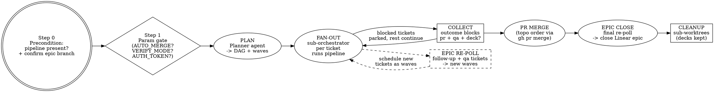

# Dark Factory

## Overview

Gastown with prompts. One **principal orchestrator** decomposes the epic and fans out one
**sub-orchestrator** per ticket; each sub-orchestrator runs the full `pipeline` skill on its
ticket and reports back a bounded outcome block. The principal merges the resulting PRs in
topological order and closes the epic.

Scale rule: `pipeline` is one orchestrator managing a swarm of agents toward a **single**
task with all of its review rounds; Dark Factory is literally that same thing over **many**
tasks at the same time. All per-ticket rigor - party deliberation, min 3 / cap 5 reviews,
simplify pass, real-data QA + deck - lives inside `pipeline` and is never re-implemented here.

**`pipeline` is a hard precondition.** Step 0 checks it is available. If it is absent, the run
pauses and tells the user exactly where to get it - it never substitutes a home-grown
implement/review loop. No `pipeline`, no factory.

**Non-negotiable constraints:**
1. **Pipeline present (Step 0).** Absent -> pause with the link, stop. Never improvise the loop.
2. **Context firewall (section 3).** The principal never reads file bodies, full diffs, full
   logs, or full ticket descriptions. Sub-orchestrators read only their pipeline's outcome
   blocks, never code. Everything heavy happens inside pipeline runs.
3. **Pipelines own quality.** The principal never reviews code, never dispatches implement or
   fix agents, never re-runs reviews. Per-ticket review loop and QA belong to `pipeline`.
4. **Shared questions once.** Anything every ticket would ask - notably local-vs-CI
   verification - is asked once by the principal at the parameter gate and propagated to all
   pipeline calls. Asking it per ticket is a protocol violation. Topic-research delta questions (adopt-X-instead-of-Y) are shared questions: asked once by the principal and propagated, never re-asked per ticket.
5. **One auth token, held centrally.** `AUTH_TOKEN` (session cookie / bearer token) is supplied
   once, held by the principal, and propagated to every ticket pipeline for QA. It travels via
   env only, never lands in files, logs, ledger, or outcome blocks. Pipelines whose QA needs no
   auth ignore it; a missing/expired token bubbles up as a single question, not one per ticket.
6. **No red merges, no force-push to `main`, no permission/settings changes.** Ever.
7. **Never manually merge ticket branches.** Ticket work lands via `gh pr merge` in
   topological order only. The orchestrator worktree is bookkeeping space, never modified.
8. **No silent scope creep.** Decisions are escalated or become Linear `follow-up` tickets
   under the epic, never silent inline expansion.
9. **Every ticket proves itself.** No ticket is done without its pipeline's QA pass and deck
   path in the outcome block - pre-merge, post-merge, or both per section 5.4.

## When to Use

- You have a Linear epic with child tickets and want it shipped end-to-end with minimal supervision.
- You have several related tickets that should each get the full pipeline treatment in parallel.
- You want parallelism across tickets without blowing out a single context window.

## When NOT to Use

- **One ticket** -> use `pipeline` directly; the factory overhead buys nothing.
- **One small, obvious change** -> just do it; the swarm overhead is not worth it.
- **You want a code review, not changes** -> use `architecture-audit` or `pr-review-toolkit`.
- **No git repo / no Linear access** -> the skill requires both.
- **The work must not touch `main`** -> set `AUTO_MERGE=false`, or do not use this skill.

## 1. Inputs / Parameters

The only required input is the Linear task ID. Everything else has a default; confirm them at the parameter gate (Step 1).

| Parameter | Default | Meaning |
|-----------|---------|---------|
| `LINEAR_TASK_ID` | (required arg) | The Linear epic/task to ship, e.g. `SYT-987`. |
| `TARGET_BRANCH` | `main` | Where each child ticket PR is merged. Propagated as each pipeline's `target`. |
| `MAX_PARALLEL` | `6` | Cap on concurrent sub-orchestrators. Each pipeline manages its own internal width; this caps tickets in flight. |
| `AUTO_MERGE` | `false` | `true` -> principal merges each clean child PR in topo order. `false` -> pipelines run with `don't merge`, principal leaves PRs open, pings user, stops. Default safe; opt in explicitly. |
| `VERIFY_MODE` | `ask` | `local` / `ci-only` / `ask`. `ask` -> principal batches the question once at the gate; the answer propagates to every pipeline via its `verify-mode` override. Never asked per ticket. |
| `AUTH_TOKEN` | (empty) | Optional session cookie / bearer token for QA. Supplied once (`auth token <value>`), held by the principal, propagated to every pipeline via its `auth token` override. Needed whenever any ticket's proof requires authenticated access - pre-merge preview, post-merge staging/production, or post-deploy. If empty and a pipeline's QA needs one, one question bubbles up; the answer is recorded once and re-propagated. |
| `WORKTREE_MODE` | `local` | `local` (git worktree) or `vm` (Conductor `{worktree_id: vm_ip}`). Pipelines create their own trees inside it; the orchestrator tree stays bookkeeping-only. |

Dropped from the old bespoke loop, now owned by `pipeline`: `MAX_REVIEW_ROUNDS` (min 3 / cap 5 per
ticket), `REVIEW_TOOL` / `REVIEW_MODULES`, background `QA_FEEDBACK` (each pipeline QA-proves its
own ticket; `qa-found` follow-ups still drain through backfill).

> **Merge gate:** if `AUTO_MERGE=false`, stop after all pipelines report with PRs open and report
> their URLs + deck paths. **Never** force-push to `main`; **never** merge a red build under any setting.

## 2. Factory flow



## Step 0 - Precondition and epic branch (blocking)

1. **Confirm `pipeline` is available.** If it is not installed or not resolvable, pause and tell
   the user exactly where to get it (install path / link), then stop. Do not proceed, do not
   substitute a bespoke implement/review loop. No `pipeline`, no factory.
2. **Confirm the current branch** with `git rev-parse --abbrev-ref HEAD`. This is the
   orchestrator's branch, already set to the epic's Linear branch name by the user. Note it in
   the ledger as the context anchor. **Do not rename, create, or check out any branch here.**
3. **Fetch the task** with the Linear MCP: `get_issue` with `id = LINEAR_TASK_ID`,
   `includeRelations: true`. Read **only** identifier + title (truncate to <=6 words) into the
   ledger. Do **not** read the description body - that is the Planner agent's job (section 5.1).
4. **Confirm** to the user: resolved task identifier + title, current branch, and that the
   `pipeline` precondition passed. Then proceed to the parameter gate.

## Step 1 - Parameter gate (blocking)

Before any pipeline is dispatched, confirm the high-consequence parameters with the user:

1. **`AUTO_MERGE`** - `true` (principal merges each clean child PR to `TARGET_BRANCH` in topo
   order) vs `false` (pipelines run with `don't merge`; PRs left open for manual review).
   Default `false`. This decides whether the run writes to `TARGET_BRANCH`; confirm explicitly.
2. **`MAX_PARALLEL`** - confirm the sub-orchestrator width matches the available worktree/VM pool.
3. **`VERIFY_MODE`** - `local` (every pipeline runs the full local gate) vs `ci-only` (every
   pipeline defers to CI). Ask once here when the default `ask` stands; the answer is recorded
   in the ledger and propagated to all pipeline calls. It is never re-asked per ticket.
4. **`AUTH_TOKEN`** - ask for a session cookie / bearer token when any ticket's QA is likely to
   need authenticated access (authed preview, staging/production, post-deploy verification). One
   token covers all tickets; record only `token: provided (redacted)`, never the value. If no
   ticket needs auth, skip it - a pipeline that hits auth without one bubbles up a single
   question, answered once and re-propagated.
5. **Linear team** - the team under which sub-orchestrators file `follow-up` / `qa-found`
   tickets (resolve via `list_issue_labels`/team metadata if not obvious from the task).

Do not start planning until these are confirmed.

## 3. The Context Firewall (read this twice)

This is the whole point. Violating it is the only way this fails.

**The principal MUST NOT:**
- Read file bodies, full diffs, full test output, full build logs, or full ticket descriptions
  into its own context.
- Implement, edit, or review code itself, or dispatch implement/fix agents directly. All work
  goes through sub-orchestrators running `pipeline`.
- Merge ticket branches into the orchestrator worktree - not via `git merge`, not via
  cherry-pick, not via any other mechanism.
- Echo a sub-orchestrator's verbose output back into its reasoning. Outcome blocks only.

**Sub-orchestrators MUST NOT:**
- Read code, diffs, or logs themselves either. They invoke `pipeline`, enforce its outcome
  schema, and bubble questions upward. Code blindness holds at both layers.

**You MUST:**
- Delegate *all* heavy reading to pipeline runs. Even epic decomposition's deep dive goes to a
  Planner agent - you keep only the DAG.
- Require every sub-orchestrator to return the **bounded outcome schema** (section 4). A prose
  dump is a protocol violation: discard and re-dispatch with the schema restated.
- Keep your entire working state in one **Ledger** (section 4 table). When it grows, compress
  merged rows to `[done] <ticket>`.
- Refer to everything large by **handle**: branch name, worktree id, Linear ticket id, PR
  number, deck path, or a Linear comment URL. Never by content. The token is never a handle -
  it is never written down anywhere except the ask itself.

If you ever feel the urge to "just look at the file to be sure" - don't. That question belongs
to a ticket's pipeline, not to you.

## 4. The Ledger and outcome schema

### The Ledger (your only memory)

Maintain this table verbatim. One row per ticket. Update in place; do not append narrative.

| Ticket | Title (<=6 words) | Wave | Sub-orchestrator | Pipeline | PR | Deck | Deps | Status | Residual risk (<=12 words) |
|--------|-------------------|------|------------------|----------|----|------|------|--------|----------------------------|

`Status` is one of `QUEUED | PIPELINE_RUNNING | PR_OPEN | MERGED | BLOCKED`.

Also keep three short lists:
- **Open questions** - `{from, question, status}` - anything bubbled up from sub-orchestrators.
- **Rebase conflicts** - `{pr, branch, status}` - PRs that conflicted on merge and need a rebase agent.
- **Backfill queue** - `{linear_id, source (follow-up | qa-found), scheduled?}`, tickets filed mid-run that must be drained before epic closure.

The ledger records `verify-mode`, `token: provided (redacted)` or `token: none`, and shared
answers - never the token value itself.

When a row hits `MERGED`, collapse it to `[done] <ticket>` (keeping its deck path in the final report) and drop its risk note.

### Sub-orchestrator Outcome Schema (enforce strictly)

Every sub-orchestrator must end its turn with **exactly** this block and nothing verbose before it:

```
=== SUB-ORCHESTRATOR OUTCOME ===
ticket:          SYT-xxx
status:          DONE | BLOCKED | NEEDS_DECISION
pr:              <PR URL - REQUIRED; "none" is a protocol violation>
verify-mode:     <local | ci-only>
rounds:          <n>/5, min 3
qa:              <pass | fail + failing proof>
deck:            <absolute copy-out path>
followups:       <linear ids filed for out-of-scope work, or none>
remaining:       <=2 lines: anything not fixed and why
blocked_on:      <ticket/decision, or none>
=== END ===
```

**An outcome without a real PR URL, a QA pass, and a deck path is a protocol violation.**
`pipeline` guarantees all three; a sub-orchestrator missing any of them did not run the
pipeline. Discard and re-dispatch with the protocol restated.

Reject and re-dispatch anything that does not conform. You read **only** this block.

## 5. Phase details

### 5.1 INTAKE + PLAN

1. **Fetch children** with `list_issues` using `parentId = LINEAR_TASK_ID`. Keep only metadata in the ledger (ids, titles, labels). If the task has **no children**, it is a single work unit: dispatch one sub-orchestrator running `pipeline` on it and skip to COLLECT (the rest of the factory is unchanged).
2. **Dispatch one Planner agent.** Planning is extraction and topological sorting, not synthesis; a missed soft dep degrades to a rebase conflict the factory already recovers from. The Planner agent deep-reads each child (via `get_issue` per child for body + `gitBranchName` + relations) and the relevant code, and returns:
   - per-ticket acceptance criteria distilled to <=3 bullets,
   - per-ticket `gitBranchName` (the work branch for that ticket),
   - a **dependency DAG** (hard deps from Linear `blocks`/`blockedBy` + soft deps from predicted shared-file contention),
   - a **wave assignment** (topological layers) honoring `MAX_PARALLEL`.
   The Planner returns this as a compact structured block - not prose. You ingest **only** the DAG + waves + branch names.
3. Populate the ledger.

### 5.2 FAN-OUT (one sub-orchestrator per ticket runs `pipeline`)

For each wave, in dependency order:
- Spin up to `MAX_PARALLEL` sub-orchestrators, one per ticket. Each creates its own pipeline
  run, which creates its own worktree and supervisor under it (`WORKTREE_MODE` applies to where
  those trees live). Use each ticket's `gitBranchName` for its work branch.
- Give each sub-orchestrator the **Sub-orchestrator Brief** (section 6) with the invocation:
  ticket id + `target {{TARGET_BRANCH}}` + `don't merge` (pipelines never merge here - the
  principal owns merges, and QA then runs pre-merge per pipeline Step 9) + `verify-mode
  {{VERIFY_MODE}}` + `auth token {{AUTH_TOKEN}}` when one was supplied (omit the override
  otherwise; pipelines that need one will bubble up a single shared question).
- Same-wave sub-orchestrators run concurrently. Collect outcome blocks. A ticket is not
  `PR_OPEN` until its outcome shows a real PR URL, `qa: pass`, and a deck path.
- `BLOCKED` / `NEEDS_DECISION` -> park the ticket, surface the one-liner to the user, continue
  with the rest. Shared questions (expired token, scope calls affecting siblings) are answered
  once and recorded, not re-asked per ticket.

**Epic re-poll (continuous backfill).** Sub-orchestrators file new child tickets under the epic
mid-run; pick them up without being told:
- **When:** at every phase boundary and every time an outcome arrives or a PR is merged. Cheap - metadata only.
- **How:** `list_issues` with `parentId = LINEAR_TASK_ID`; diff the returned ids against the ledger. Any id not already in the ledger is new work. An outcome's `followups` field is the fast path - schedule those immediately rather than waiting for the next poll.
- **Then:** add each new ticket as a ledger row (and to the Backfill queue), assign it to a fresh wave, and run it through the same FAN-OUT -> COLLECT -> MERGE path. Honor `blocks`/`blockedBy` so a backfill ticket blocked by in-flight work waits for its blockers.
- **Gate coupling:** epic closure (5.5) cannot proceed while any un-scheduled or in-flight `follow-up`/`qa-found` ticket exists. Drain the epic to empty first.

### 5.3 COLLECT (owned by the outcome schema, not by you)

The principal does **not** review code, accumulate findings, or dispatch fix agents. That all
happened inside each ticket's pipeline. The principal only verifies the outcome:

- Outcome has `pr: <URL>` (real URL, not "none")
- Outcome has `qa: pass` and a `deck:` path that exists
- Rounds line present (`<n>/5, min 3`)
- CI is green on the PR (check via `gh pr checks <PR>`)

If the outcome is `BLOCKED` / `NEEDS_DECISION`, mark the ticket `BLOCKED` and escalate the
one-liner to the user. Do not reach into the ticket's pipeline to repair it yourself -
re-dispatch the sub-orchestrator with the decision or the corrected brief.

If CI is red after a DONE outcome (a race with a post-push check): dispatch a **targeted Fix
agent** on that ticket's worktree with the specific failing CI output (handle only - no raw
logs). It fixes, re-verifies in the ticket's `verify-mode`, and pushes. You only read its
one-line result.

### 5.4 PR MERGE (topological order; skipped when `AUTO_MERGE=false`)

Merge ticket PRs in topological order (no PR is merged before all its `blocks`/`blockedBy` deps are `MERGED`):

1. For each eligible PR: verify CI is green, then run `gh pr merge <PR> --squash --delete-branch` (or `--merge` per repo convention). Abort and surface the failure if red.
2. **Conflict on merge:** if `gh pr merge` fails due to conflict (the PR branch is behind `TARGET_BRANCH` after previous merges):
   - Dispatch a **Rebase agent**. The rebase is mechanical: on that ticket's worktree run
     `git fetch origin {{TARGET_BRANCH}} && git rebase origin/{{TARGET_BRANCH}}`, resolve
     conflicts, re-verify in the ticket's `verify-mode`, and force-push the branch only. No
     re-review runs - the ticket's pipeline already completed min 3 / cap 5; a rebase is not a
     new implementation.
   - Structural/ambiguous conflict -> stop, escalate to the user.
3. Mark the ticket `MERGED` in the ledger. Collapse the row (deck path retained for the report).
4. **Sync the orchestrator branch with `TARGET_BRANCH`** after each merge: `git fetch origin && git rebase origin/{{TARGET_BRANCH}}`. Resolve any conflicts directly - do not dispatch an agent for this. The orchestrator branch carries no code changes, so conflicts are rare and always local. Resolve, then continue.
5. After each merge, re-poll the epic (5.2) for new backfill tickets.
6. **Post-merge QA where required.** Pipelines ran with `don't merge`, so their QA proved the
   worktree/preview. Any ticket whose proof is only meaningful post-merge or post-deploy
   (authed production path, deploy-gated behavior) gets a post-merge pass: re-dispatch its
   sub-orchestrator to run that ticket pipeline's Step 9 against the merged `TARGET_BRANCH`
   with `auth token {{AUTH_TOKEN}}` (asking once if it was never supplied). A post-merge QA
   failure becomes a `follow-up` ticket under the epic, never a silent patch to main.

### 5.5 EPIC CLOSE

Runs only when all ledger rows are `MERGED`, post-merge QA passes are in, and the Backfill queue is empty.

1. **Final re-poll:** run `list_issues` with `parentId = LINEAR_TASK_ID` one last time. Any new ticket found resets to FAN-OUT for that ticket - do not skip it. Only proceed if the re-poll returns nothing new.
2. **Close the epic** in Linear: `save_issue` with `id = LINEAR_TASK_ID`, `stateId = <done state id>` (resolve via `list_issue_statuses` for the team). Add a comment via `save_comment` summarizing what shipped, with PR + deck links per ticket.
3. If `AUTO_MERGE=false` (PRs opened but not merged), skip epic closure and instead ping the user with all PR URLs and deck paths for manual review and merge.

### 5.6 CLEANUP (always, even on partial failure)

- Verify every ticket's deck copy-out path exists (absolute paths from the outcome blocks - they
  live outside the worktrees by pipeline contract), then remove every **sub-worktree** the
  pipelines created (`git worktree remove <path> --force`). Do **not** touch the orchestrator worktree - the user manages that.
- Delete merged ticket branches: `git branch -d <branch>` locally (the remote branch is deleted by `--delete-branch` at merge time).
- Verify `git worktree list` shows only the orchestrator worktree and the tree is clean.
- In `vm` mode, return Conductor VMs to the pool.
- Emit the final report (section 9).

## 6. Sub-orchestrator Brief (the fan-out unit - paste per sub-orchestrator)

> You own **{{TICKET}}** end to end. Run the `pipeline` skill on it with exactly these
> overrides: `target {{TARGET_BRANCH}}`, `don't merge`, `verify-mode {{VERIFY_MODE}}`.
> {{AUTH_TOKEN_LINE}}Acceptance criteria: {{AC}}. Work branch: the ticket's Linear `gitBranchName`.
> (`{{AUTH_TOKEN_LINE}}` is `auth token <value>,` when a token was supplied at the gate and empty otherwise.)
> 1. **Run the pipeline, do not freelance.** Invoke `pipeline` with the ticket id and the
>    overrides above. Never implement, review, or QA anything yourself - the pipeline's swarm
>    does that. Your job is invocation, question-routing, and outcome enforcement.
> 2. **Route questions upward.** Your pipeline's supervisor will surface batched questions
>    (session tokens, scope calls, verify-mode edge cases). Answer what is ticket-local yourself
>    only if it is unambiguous; bubble everything else to the principal via `hub` with a
>    one-liner. If your pipeline's QA needs an auth token and none was supplied, bubble one
>    shared question - never invent, borrow, or log a token yourself. Never let your pipeline
>    stall silently waiting.
> 3. **Enforce the outcome.** When the pipeline finishes, collect its final report and convert
>    it to the **Outcome Schema** (section 4): real PR URL, verify-mode, rounds, QA result,
>    absolute deck path, followups. If any of PR / QA-pass / deck-path is missing, that is a
>    protocol violation - say so, do not paper over it.
> 4. **File follow-up work in Linear** for anything the pipeline reports as out of scope (extra
>    refactors, newly found bugs, prerequisite work) that is not already filed. Use `save_issue`
>    with `parentId = {{EPIC_ID}}`, `team = {{TEAM}}`, `labels = ["follow-up", <severity>]`, and
>    a self-contained description. The principal polls the epic and will schedule it - you must
>    not run a second pipeline for it yourself.
> 5. End with the **Outcome block** (section 4) and nothing more. Keep prose minimal - only the
>    block is read.

## 7. QA (per ticket, inside each pipeline - no background agent)

There is no epic-level background QA agent. Each ticket's pipeline proves itself with real data
and leaves a slide deck (pipeline Step 9), pre-merge against its worktree/preview. The
principal's QA job is verification of outcomes, not testing:

1. Every DONE outcome must carry `qa: pass` plus the failing-proof detail on any other value.
2. Every DONE outcome must carry an existing absolute `deck:` path.
   States unreachable against a live env (error states, destructive paths, edge cases) are proven
   per ticket in the repo's component workshop (Storybook, Ladle, or equivalent) with stories on
   the actual changed files - workshop renders are captured evidence in the deck, labeled with
   their source. Standalone mockups never count.
3. Tickets whose proof is only meaningful post-merge/post-deploy get the 5.4 item-6 pass with
   `AUTH_TOKEN` after the principal merges.
4. Defects found by any QA pass that exceed the ticket's scope arrive as `followups` filed
   under the epic and drain through backfill (5.2) like any other new ticket.

Epic closure cannot proceed while any ticket lacks its required QA pass or a deck.

## 8. Guardrails

- **Parallelism:** never exceed `MAX_PARALLEL` live sub-orchestrators; each pipeline manages its
  own internal agent width beneath that cap.
- **One ticket, one pipeline, one worktree.** Never two pipelines on the same ticket or branch.
  Overlap creates conflicts you then pay to resolve.
- **Token hygiene:** the token travels principal -> sub-orchestrator -> pipeline supervisor via
  prompt/env only. It is never written to files, logs, ledger, outcome blocks, or Linear. Any
  agent that prints one is stopped and re-dispatched.
- **Model tiers:** clerical agents use cheaper/faster agents. Pipelines run on the session
  default; never downgrade a run that writes application code.
- **Idempotency:** sub-orchestrators must be resumable - re-running on a partially-done ticket
  re-enters its pipeline safely. Step 0's checks are idempotent.
- **No silent scope creep:** unclear ticket -> `NEEDS_DECISION`, not improvisation.
- **Shared questions once:** `VERIFY_MODE` and `AUTH_TOKEN` are decided at the gate and
  propagated. Any question whose answer would apply to every ticket is answered once, recorded
  in the ledger, and never re-asked.
- **Backfill discipline:** re-poll the epic at every phase boundary and on every PR merge;
  schedule new `follow-up`/`qa-found` tickets as fresh waves before epic closure.
- **No red merges, no force-push to `TARGET_BRANCH`, no permission/settings changes.**
- **No manual branch merges:** ticket branches land via `gh pr merge` only.
- **Escalation:** anything `BLOCKED` after re-dispatch, or any structural rebase conflict, stops
  and pings the user with a one-line summary - do not grind.
- **Context:** if any outcome block exceeds the schema, discard and re-dispatch. Protect your context.

## 9. Final Report (to the user)

A single compact summary: epic id, `verify-mode` used for all tickets, `token: provided
(redacted)` or `token: none`, tickets shipped vs blocked, all PR URLs (merged or open),
per-ticket rounds + QA (pre/post-merge) + deck path, follow-up tickets filed/scheduled, epic
closed in Linear (y/n), sub-worktrees cleaned (y/n), and any escalations needing a decision. No
transcripts.

## Quick Reference

| Phase | Who runs | What the principal keeps |
|-------|----------|-----------------------------|
| Step 0 precondition + branch | Main thread (skill check + git + Linear MCP) | pipeline-present boolean, epic id, title, current branch |
| Step 1 param gate | Main thread + user | `AUTO_MERGE`, `MAX_PARALLEL`, `VERIFY_MODE`, `AUTH_TOKEN` (redacted), team |
| PLAN | Planner agent | DAG + waves + per-ticket branches |
| FAN-OUT | Sub-orchestrators (parallel, each runs `pipeline`) | Outcome blocks + PR URLs |
| Epic re-poll | Main thread (Linear MCP) | new ticket ids -> Backfill queue |
| COLLECT | Main thread (schema check + `gh pr checks`) | per-ticket done/blocked state |
| PR MERGE | Main thread (`gh pr merge`, topo order) | PR merge status + post-merge QA passes |
| EPIC CLOSE | Main thread (Linear MCP) | closure confirmation |
| CLEANUP | Main thread | sub-worktree-clean boolean + deck paths |

## Common Mistakes

- **Proceeding without the `pipeline` skill.** The precondition is the whole factory. Pause with the link; never improvise the loop.
- **Reading code/diffs/logs into your own context.** The single failure mode. Delegate everything heavy; consume only outcome blocks.
- **Implementing, reviewing, or QA-ing at the principal layer.** Pipelines own all three. The principal coordinates, merges, and verifies outcomes.
- **Letting a sub-orchestrator freelance.** It runs `pipeline` with the brief's overrides. A sub-orchestrator that implements directly has broken the pattern - discard and re-dispatch.
- **Merging inside ticket pipelines.** Pipelines run with `don't merge`; all merges happen at 5.4 in topo order. A merged ticket PR breaks ordering guarantees.
- **Accepting mockups as workshop proof.** Workshop stories must exercise the actual changed files. A standalone recreation of the look is not verification.
- **Asking shared questions per ticket.** `VERIFY_MODE` and `AUTH_TOKEN` are decided once at the gate and propagated. Per-ticket repeats burn context and risk divergent answers.
- **Logging or persisting the token.** It travels via prompt/env and is recorded only as `provided (redacted)`. Any file, log, ledger, or Linear content containing it is a breach - rotate and re-dispatch.
- **Accepting an outcome without a real PR URL, QA pass, or deck path.** Missing any of the three means the pipeline did not run. Discard, re-dispatch with the protocol restated.
- **Manually merging ticket branches into the orchestrator worktree.** Never run `git merge` on a ticket branch. All merges happen via `gh pr merge`. The orchestrator worktree's branch is never modified.
- **Merging on `AUTO_MERGE=false`.** That mode stops at open PRs plus deck paths. Merging is a different, explicit setting.
- **Closing the epic before the final re-poll.** Always run one last `list_issues parentId=LINEAR_TASK_ID` and confirm it returns nothing new before calling `save_issue` to close.
- **Merging or closing with undrained backfill.** Follow-up and qa-found tickets block epic closure until scheduled and merged.
- **Skipping post-merge QA for deploy-gated tickets.** Pre-merge proof does not cover post-merge behavior. Tickets that need it get the 5.4 item-6 pass with the token.
- **Two pipelines on the same ticket or branch.** One ticket, one pipeline, one worktree.
- **Forgetting to re-poll the epic.** Sub-orchestrators file follow-up tickets mid-run; if the principal does not re-poll, that work is silently dropped and the epic ships incomplete.
- **Removing worktrees before verifying deck copy-out paths.** Decks live outside the worktrees by pipeline contract - confirm each absolute path first, then remove.
- **Deleting the orchestrator worktree.** Cleanup only removes pipeline sub-worktrees. The orchestrator worktree is the user's responsibility.
- **Skipping cleanup on failure.** Cleanup runs always, even on partial failure - leftover worktrees and branches pollute the next run.

$ARGUMENTS
