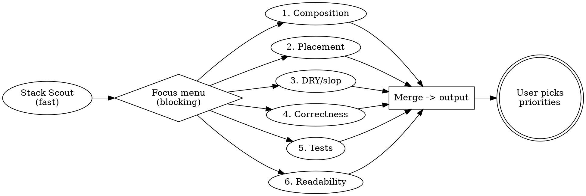

# Code Quality + Architecture v2 Implementation Plan

> **For agentic workers:** REQUIRED SUB-SKILL: Use superpowers:subagent-driven-development (recommended) or superpowers:executing-plans to implement this plan task-by-task. Steps use checkbox (`- [ ]`) syntax for tracking.

**Goal:** Restructure jp-skills to `skills/` v2 layout, replace three stack audits with one intake-driven `code-quality-audit`, add composition framing to `architecture-audit`, and ship upgrade + release wiring as 2.0.0.

**Architecture:** Pure `git mv` relocation plus markdown-only skill edits; no code, no tests, verification by read-through and grep link/shape checks. New `skills/cleanup/SKILL.md` is terminal (no tail); every other skill tails into it.

**Tech Stack:** Markdown skill files following the repo's SKILL.md shape (frontmatter `name` + `description`, `##` sections, Framework tail). `git mv` / `git rm` for moves.

## Global Constraints

- Skill instructions are generic actions; each harness maps dispatch/ask/read/search/edit/run to native tools.
- Every skill except `cleanup` ends with the Framework tail pointing at `../cleanup/SKILL.md` (fallback `$JP_SKILLS_REPO/skills/cleanup/SKILL.md`); `cleanup` itself is terminal with no tail.
- New skills: one directory, one `SKILL.md` with `name` + `description` frontmatter.
- `VERSION` at repo root is the version source of truth; this ships as `2.0.0` with a `CHANGELOG.md` breaking entry.
- Audits never change application behavior; every finding carries file:lines plus WHY; group related; drop Minors past 50; direction-is-shape, no diffs.
- Upgrade flow uses `git pull --ff-only`; refused pull → report `git status --short`, STOP, never force-pull.
- Harness registries are five targets: `~/.claude/skills/`, `~/.agents/skills/`, `~/.codex/skills/`, `~/.pi/agent/skills/`, `~/.omp/agent/skills/`; restart `omp` after relinking.
- Do not start Task 1 until the user confirms concurrent skill-adding agents are done; re-inventory at execution time, never assume the 10-dir baseline.

---

## File Structure

- `skills/<name>/SKILL.md` — every skill lives here after Task 1 (including `cleanup`, `code-quality-audit`, `architecture-audit`, `upgrading-jp-skills`, plus `pipeline`, `dark-factory`, `hotfix`, `pr-review-toolkit`, `topic-research`, `server-maintenance`, and any new skills landed by concurrent agents).
- `skills/cleanup/SKILL.md` — terminal shared skill (Task 2). No Framework tail.
- `skills/code-quality-audit/SKILL.md` — unified intake-driven audit (Task 4).
- `shared/cleanup.md` — archival pointer only, not live (Task 2).
- `README.md`, `CHANGELOG.md`, `VERSION` — v2 wiring (Task 7).

---

### Task 1: Pre-flight gate and relocate skills under `skills/`

**Files:**
- Move (via `git mv`): every root `<skill>/` containing `SKILL.md` → `skills/<skill>/`, except the three retired audits.
- Delete (via `git rm -r`): `nextjs-code-quality-audit/`, `elysia-code-quality-audit/`, `vite-tauri-code-quality-audit/` at root.
- Test: `ls -d skills/*/`, `git status --short`.

**Interfaces:**
- Consumes: spec `docs/superpowers/specs/2026-10-02-code-quality-architecture-v2-design.md` (Decisions: full replacement, `git mv` v2).
- Produces: `skills/` layout every later task relies on.

- [ ] **Step 1: Confirm concurrent agents are done**

Ask the user: "Concurrent skill agents done — may I re-inventory and move?" Do not proceed on assumption; wait for yes.

- [ ] **Step 2: Verify tracked-clean tree and inventory at execution time**
Run:

```bash
git diff --quiet && git diff --cached --quiet && echo TRACKED_CLEAN
for d in */; do [ -f "$d/SKILL.md" ] && echo "TRACKED:$d"; done | sort
git status --short | grep '^??' || echo NO_UNTRACKED
```

Expected: `TRACKED_CLEAN`; `TRACKED:` lines list every root skill dir present at execution time (baseline plus anything concurrent agents landed). Untracked `??` lines are informational only — plan/spec docs showing as `??` never block. If tracked tree dirty, STOP and report; do not move.

- [ ] **Step 3: Relocate with dynamic inventory, retire the three stack audits**

No hardcoded skill list — glob at execution time. Never move `docs/`, `shared/`, `skills/`, `.superpowers/`, `.serena/`, `.pi/`:

mkdir -p skills
for d in */; do
  skill="${d%/}"
  case "$skill" in docs|shared|skills|.superpowers|.serena|.pi) continue;; esac
  [ -f "$skill/SKILL.md" ] || continue
  case "$skill" in nextjs-code-quality-audit|elysia-code-quality-audit|vite-tauri-code-quality-audit) continue;; esac
  git mv "$skill" "skills/$skill"
done
for s in nextjs-code-quality-audit elysia-code-quality-audit vite-tauri-code-quality-audit; do
  [ -d "$s" ] || continue
  git rm -r "$s"
done
ls -d skills/*/

Expected: `ls` shows every surviving skill under `skills/` (including anything concurrent agents added); `skills/cleanup/` absent until Task 2; no root `<skill>/SKILL.md` remains except retired-deleted.

- [ ] **Step 4: Commit the move**

git status --short -- skills/ nextjs-code-quality-audit elysia-code-quality-audit vite-tauri-code-quality-audit | head -30
git add -- skills/ nextjs-code-quality-audit elysia-code-quality-audit vite-tauri-code-quality-audit
git commit -m "refactor!: move skills under skills/ layout, retire stack audits"
```

---

### Task 2: Create `skills/cleanup/SKILL.md` and archive `shared/cleanup.md`

**Files:**
- Create: `skills/cleanup/SKILL.md`
- Modify: `shared/cleanup.md` (overwrite with pointer)
- Test: read-through of the new skill; `cat shared/cleanup.md`.

**Interfaces:**
- Consumes: Task 1 `skills/` layout.
- Produces: tail target Tasks 3–6 point at.

- [ ] **Step 1: Write the terminal cleanup skill**

Write `skills/cleanup/SKILL.md` verbatim:

```markdown
---
name: cleanup
description: Runs after every other skill runs — clears your own tmp scratch under the canonical home and persists record corrections to the owning record. Terminal skill with no Framework tail.
---

# Cleanup

Runs after every other skill runs. This skill is terminal: it has no Framework tail and no other skill tails into anything else.

## Canonical home

`$JP_SKILLS_HOME`, else `$XDG_CONFIG_HOME/jp-skills`, else `~/.config/jp-skills` (XDG default; Windows `%APPDATA%\jp-skills`): `config.json` (`repo_path`, `installed_version`, `updated_at`), `servers/`, `tmp/<skill>/`, `worktrees/<repo>/<branch>/`.

## Steps

1. Clear only `tmp/<your-skill-name>/` scratch you made. Other skills' scratch is theirs. Scratch is never committed.
2. Persist corrections into the owning record under the home dir (server fixes go to `servers/<slug>.md` Troubleshooting) so the next run inherits them.
3. Never touch `VERSION`, `CHANGELOG.md`, or another skill's records during a normal run.
```

- [ ] **Step 2: Archive the old tail as a pointer**

Overwrite `shared/cleanup.md` verbatim with:

```markdown
# Archived

Live content moved to `skills/cleanup/SKILL.md`. This file stays as an archival pointer only.
```

- [ ] **Step 3: Commit**

```bash
git add skills/cleanup/SKILL.md shared/cleanup.md
git commit -m "Add cleanup terminal skill, archive shared tail"
```

---

### Task 3: Retarget every Framework tail to `../cleanup/SKILL.md`

**Files:**
- Modify: every `skills/*/SKILL.md` except `skills/cleanup/SKILL.md` (tail block only, last 3 lines).
- Test: `grep -rn "cleanup" --include="SKILL.md" skills/`.

**Interfaces:**
- Consumes: Tasks 1–2 outputs.
- Produces: uniform tails Task 7 verifies.

- [ ] **Step 1: Replace each tail block**

For every `skills/<name>/SKILL.md` where `<name>` is not `cleanup`, replace the tail block (whatever its current `../shared/cleanup.md` / `$JP_SKILLS_REPO/shared/cleanup.md` wording) with exactly:

```markdown
## Framework tail

Before finishing, read `../cleanup/SKILL.md` (relative to this skill's repo directory; fallback `$JP_SKILLS_REPO/skills/cleanup/SKILL.md`) and follow it.
```

Do not touch any other line in those files. Do not add a tail to `skills/cleanup/SKILL.md`.

- [ ] **Step 2: Verify no stale tail survives**

Run: `grep -rn "shared/cleanup" --include="SKILL.md" skills/ ; grep -rn "cleanup/SKILL" --include="SKILL.md" skills/ | wc -l`
Expected: first grep empty; second count equals (number of skills minus one for cleanup).

- [ ] **Step 3: Commit**

```bash
git add skills/
git commit -m "Retarget framework tails to skills/cleanup"
```

---

### Task 4: Create `skills/code-quality-audit/SKILL.md`

**Files:**
- Create: `skills/code-quality-audit/SKILL.md`
- Test: read-through against spec (scout fields, mixed-slice rule, 4-way focus-as-weighting, 6 lenses, composition preamble, output shape).

**Interfaces:**
- Consumes: spec Decisions (scout contract, focus menu, 6 lenses, rules); Task 2 tail target.
- Produces: skill file Task 7 links from README.

- [ ] **Step 1: Write the skill file**

Write `skills/code-quality-audit/SKILL.md` verbatim:

```markdown
---
name: code-quality-audit
description: Use when you want a repeatable, intake-driven code quality audit of a codebase — UI bugs, code bugs, cleanup/slop, or full audit. Stack scout detects stack and GUI-ness, you pick the focus, six composition-biased lenses run in parallel. Outputs prioritized findings directly. Does not change application logic.
---

# Code Quality Audit

## Overview

Dispatch one fast scout, confirm focus with the user, then fan six lenses out in parallel. Focus is weighting, not subset: all six lenses always run; the chosen focus gets Critical weight while the rest drop to Moderate+. Read-only; the user owns all edits.

**Non-negotiable constraint:** No fix may change application behavior. Every recommendation targets structure, abstraction, tests, or readability — never logic.

## When to Use

- Before a refactor or release stabilization
- Inheriting or onboarding to a messy codebase
- Periodic hygiene with a specific focus (UI bugs vs code bugs vs cleanup)
- When NOT to use: scoped subsystem architecture (use `architecture-audit`); security review; linter/style-only pass.

## Pipeline



## Step 1 - Stack Scout (fast agent)

Read root manifests (`package.json`, `Cargo.toml`, `pyproject.toml`, `go.mod`), root configs (`next.config.*`, `vite.config.*`, `tsconfig.json`, `tauri.conf.json`), sample extensions under `src/`. Return exactly:

```text
stack: <next.js | elysia | vite-tauri | rust | django | rails | spring | dotnet | unknown>
gui: <none | react-ssr | react-spa | tauri | other>
dominant_libs: [<top 3-5 by import count>]
stack_concerns: [<2-4 architectural bullets, e.g. RSC/client boundary, Elysia plugin scope, Tauri IPC side>]
mixed: <false | true + slice candidates, e.g. apps/web, apps/api, src-tauri>
```

If `mixed: true`, list slice candidates (monorepo apps, `src-tauri/`, service dirs). Intake must force a single-slice pick. No multi-slice single pass.

## Step 2 - Focus Intake (blocking)

Present the scout result, then ask:

1. **Focus:** UI bugs / Code bugs / Cleanup-slop / Full audit (default Full).
2. **Slice (only if mixed):** pick exactly one; required before lenses run.
3. **Severity threshold:** default Moderate and above; Minor dropped.
4. **Scope:** default whole repo (or chosen slice); user may narrow to a dir.
5. **Emphasize/skip:** optional free-text.

Weighting: chosen focus runs at full weight (may file Criticals); non-focus lenses file Moderate at highest. Full audit: all six at full weight.

## Step 3 - Six Lenses (parallel)

Shared preamble appended to every lens prompt: "Prefer functional units doing one thing well: stateless inner plus stateful wrapper that gathers hooks; hooks as a separate module behind a provider/adapter; route as thin adapter delegating to a service; composition over multi-thing modules. Flag the 10-components-in-one-file shape wherever it appears."

### Lens 1 - Composition and Single-Purpose

Multi-thing functions, stateful/stateless mixing in one file, god modules, wrapper components swallowing inner components that should compose. Proposed shape: stateless inner + stateful wrapper + hooks module + provider/adapter split.

### Lens 2 - Concern Placement

Logic at the wrong layer, using `stack_concerns` as the table: auth/session in pages (belongs in middleware), business logic in route handlers (belongs in service), FS/heavy compute in JS (belongs in a Rust command), duplicated validation a schema would enforce. Only flag moves that cut duplication or fix correctness.

### Lens 3 - DRY and Slop

Duplication across 2+ files with minor variation: repeated fetch/error patterns, copy-paste utils, repeated Tailwind/class combos, repeated auth+tenant+pagination preambles, repeated query/schema fragments. Group by the abstraction that kills the group. Skip sub-3-line duplication.

### Lens 4 - Correctness and Bugs

Real bugs only: null/empty/error paths, tenant leaks (missing user `where`), mutations without `where`, secret-shaped `VITE_*` env (ships in bundle), overbroad allowlists (`fs **`, `origin *` + credentials), swallowed errors (`catch {}`), raw error leakage to clients. Any leaked secret, tenant leak, or `where`-less mutation is Critical by default.

### Lens 5 - Tests and Seams

Untested units with branching logic, branch-coverage gaps, error-path gaps (401/403/404/422/500), mock-abuse hiding integration risk, untestable wiring with no seam, tests asserting nothing. Skip trivial files (re-exports, type-only, generated bindings).

### Lens 6 - Readability and Comments

Functions over ~40 lines doing multiple things, unclear names (`data`, `result`, `temp`, `handleClick2`), nesting over 3 levels, magic literals, boolean-arg soup, `any` that could be typed, comments describing WHAT instead of WHY, verbose or stale comments, dead code and orphaned files. Skip style/linter-only nits.

## Output

Print directly to the conversation. Do not write to a file. Use this structure:

```markdown
# Code Quality Audit - [Project / Slice]

> No skill action changed application code. The implementor owns all edits.

## Summary

- Stack: <stack + gui + dominant_libs>
- Slice: <repo-wide | path>
- Focus: <UI bugs | Code bugs | Cleanup | Full>
- Findings: <N> (Critical <a>, Moderate <b>, Minor <c>)

## Critical

### [CQ-001] <short title>
- Files: `<path:lines>`, ...
- Lens: <Composition | Placement | DRY | Correctness | Tests | Readability>
- Current: <what exists>
- Recommended: <shape, no diff>
- Why: <human benefit>

## Moderate
(repeat shape)

## Minor
(repeat shape)
```

## Rules for All Lenses

1. **No behavior changes.** Never flag removing a check that changes null/error behavior.
2. **Be specific.** File paths, line ranges, concrete references. No vague "consider improving".
3. **Explain WHY.** Every finding states the benefit in human terms.
4. **Skip trivial.** Style, formatting, sub-3-line duplication.
5. **Group related.** Five files, one pattern: one finding with the union of paths.
6. **Prioritize ruthlessly.** Past 50 items, drop Minors until it fits.
7. **One lens, one perspective.** Lenses do not poach; merge combines.

## Common Mistakes

- Running lenses before the user picks focus/slice.
- Auditing two slices in one pass on a mixed stack.
- Flagging style as structure; suggesting rewrites over targeted splits.
- Filing non-focus nits as Critical.

## Framework tail

Before finishing, read `../cleanup/SKILL.md` (relative to this skill's repo directory; fallback `$JP_SKILLS_REPO/skills/cleanup/SKILL.md`) and follow it.
```

- [ ] **Step 2: Read it back and trace the spec**

Run: `read skills/code-quality-audit/SKILL.md` (full file).
Expected: scout fields match spec verbatim; mixed→single-slice rule present; 4-way focus with weighting-not-subset; six lenses each carrying the composition preamble; Critical-by-default list for secrets/tenant/`where`-less; tail points at `../cleanup/SKILL.md`.

- [ ] **Step 3: Commit**

```bash
git add skills/code-quality-audit/SKILL.md
git commit -m "Add unified code-quality-audit skill"
```

---

### Task 5: Add functional-unit framing to `architecture-audit` lenses

**Files:**
- Modify: `skills/architecture-audit/SKILL.md` (lens prompt addon; keep 5 lenses, intake, consensus, TDD plans untouched).
- Test: read-through of the five lens sections; `grep -n "functional unit" skills/architecture-audit/SKILL.md`.

**Interfaces:**
- Consumes: Task 1 move; spec Decisions (lens addon text).
- Produces: arch-audit v2 framing Task 7 ships.

- [ ] **Step 1: Insert the addon paragraph into all five lens prompts**

After the `## Step 4 - Architect Agents (parallel, 5 lenses)` intro line ("Dispatch all five agents in parallel..."), insert exactly:

```markdown
**Functional-unit bias (applies to all five lenses):** Prefer functional units doing one thing well — stateless inner plus stateful wrapper that gathers hooks, hooks as a module behind a provider/adapter, route as thin adapter delegating to a service, Unix-philosophy splits. Flag multi-purpose modules, stateful/stateless mixing, and dependencies that should split.
```

Then append one hook line to each lens intro:
- Agent 1 Boundaries: "Hook: wrapper/component/service split violations, leaky units."
- Agent 2 Data Flow: "Hook: state lives vs mutates across the wrapper/hook/provider chain."
- Agent 3 Dependency Direction: "Hook: god modules, high in-edge units, stable/volatile mismatch."
- Agent 4 Testability: "Hook: could one unit be tested in isolation tomorrow."
- Agent 5 Complexity: "Hook: parallel hierarchies, feature envy, abstractions not earning weight."

Do not change intake, scout/discovery, confirm gate, consensus `>=2` rule, Critical-single-agent exception, TDD Red/Green/Refactor shape, or stop-after-prioritize.

- [ ] **Step 2: Verify lenses and consensus untouched**

Run: `grep -n "functional unit\|Hook:\|Consensus\|Red:\|Green:\|Refactor:" skills/architecture-audit/SKILL.md`
Expected: addon present once; five hook lines; consensus and TDD keywords still present.

- [ ] **Step 3: Commit**

```bash
git add skills/architecture-audit/SKILL.md
git commit -m "Add functional-unit framing to architecture-audit"
```

---

### Task 6: Add v2 migration block to `upgrading-jp-skills`

**Files:**
- Modify: `skills/upgrading-jp-skills/SKILL.md` (Flow + Relink steps; keep pull-guard and stamp logic).
- Test: read-through; `grep -n "skills/" skills/upgrading-jp-skills/SKILL.md`.

**Interfaces:**
- Consumes: Tasks 1–2 layout; spec Decisions (v2 symlink swap, five registries).
- Produces: upgrade path Task 7 ships.

- [ ] **Step 1: Replace the Flow Migration/Relink steps**

Replace existing steps 5–6 with exactly:

```markdown
5. Detect pre-v2: if `<repo>/skills/` is missing but `<repo>/architecture-audit/SKILL.md` exists, this is a v1 checkout. After a clean `pull --ff-only`, delete stale root symlinks (`<skill>` entries that are symlinks to the old root dirs) in all five registries, then continue.
6. Relink: for every `<repo>/skills/*/SKILL.md`, ensure symlinks in `~/.claude/skills/`, `~/.agents/skills/`, `~/.codex/skills/`, `~/.pi/agent/skills/`, `~/.omp/agent/skills/`. Remove any registry symlink whose target no longer exists (covers the three retired stack audits). Restart `omp` afterwards so discovery runs again.
```

Keep steps 1–4 (resolve repo, ensure dirs, `pull --ff-only` with `git status --short` STOP on refuse, VERSION compare) and step 7 (stamp `config.json`) unchanged.

- [ ] **Step 2: Verify guardrails intact**

Run: `grep -n "ff-only\|status --short\|installed_version" skills/upgrading-jp-skills/SKILL.md`
Expected: pull guard, refuse-STOP, and stamp lines all present alongside the new v2 block.

- [ ] **Step 3: Commit**

```bash
git add skills/upgrading-jp-skills/SKILL.md
git commit -m "Add v2 migration and relink to upgrading-jp-skills"
```

---

### Task 7: Wire README, CHANGELOG, VERSION and verify

**Files:**
- Modify: `README.md` (skill links, layout block, tail refs, link-all loop).
- Modify: `CHANGELOG.md` (new `## [2.0.0]` entry).
- Modify: `VERSION` (`1.2.0` → `2.0.0`).
- Test: greps below plus `git status --short` clean.

**Interfaces:**
- Consumes: Tasks 1–6 outputs.
- Produces: shippable 2.0.0.

- [ ] **Step 1: Retarget README skill links and layout**

Apply exactly:
- Audits table: replace the three stack-audit rows with one row: ``| [`code-quality-audit`](skills/code-quality-audit/SKILL.md) | A repeatable intake-driven quality audit — scout detects stack/GUI-ness, you pick UI bugs / code bugs / cleanup / full, six lenses run in parallel. | Read-only |``
- Every other skill link `<name>/SKILL.md` → `skills/<name>/SKILL.md`.
- Stable-home paragraph: `shared/cleanup.md` → `skills/cleanup/SKILL.md`.
- Repo Layout block: `shared/cleanup.md       # ...` → `skills/cleanup/SKILL.md # Terminal shared skill, no tail`; `<skill-name>/` → `skills/<skill-name>/`.
- Adding A Skill: `../shared/cleanup.md` → `../cleanup/SKILL.md`.
- Link Everything loop: `for d in */;` → `for d in skills/*/;` and inner `[ -f "$skill/SKILL.md" ]` → `[ -f "skills/$skill/SKILL.md" ]`, `ln -s "$PWD/$skill"` → `ln -s "$PWD/skills/$skill"`.

- [ ] **Step 2: Add the CHANGELOG entry**

At the top after line 3, insert exactly:

```markdown
## [2.0.0] - 2026-10-02

### Breaking

- Skills live under `skills/<name>/SKILL.md`; `shared/cleanup.md` archived as pointer to terminal `skills/cleanup/SKILL.md` (no self-tail). Upgrade via `upgrading-jp-skills` v2 block: pull, drop stale root symlinks, relink from `skills/*/SKILL.md` across all five registries.
- Unified `code-quality-audit` replaces `nextjs-`, `elysia-`, `vite-tauri-code-quality-audit` (deleted): stack scout (stack + gui + dominant libs + mixed-slice rule) → 4-way focus intake (weighting, not subset) → six composition-biased lenses → merge → prioritize/stop.
- `architecture-audit` keeps 5 lenses + consensus; prompts gain functional-unit bias (stateless inner + stateful wrapper, hooks behind provider/adapter, route → service).
```

- [ ] **Step 3: Bump VERSION and verify everything**

Run:

```bash
echo "2.0.0" > VERSION
grep -rn "shared/cleanup" --include="*.md" README.md skills/ ; echo "stale-tail-grep-exit:$?"
grep -rn "skills/code-quality-audit/SKILL.md" README.md CHANGELOG.md
ls -d skills/*/ | sort
git status --short
```

Expected: first grep empty (exit 1); second grep hits README + CHANGELOG; `ls` shows all skills including `cleanup/` and `code-quality-audit/`, no retired audits; status shows only intended modifies.

- [ ] **Step 4: Commit the release wiring**

```bash
git add README.md CHANGELOG.md VERSION
git commit -m "Wire v2 release (2.0.0)"
```

---

## Self-review

- Spec coverage: v2 layout + cleanup-terminal → Tasks 1–3; full replacement → Task 1 delete + Task 4 create; scout contract + mixed-slice + focus weighting + 6 lenses + preamble → Task 4; arch-audit framing untouched-consensus → Task 5; upgrade v2 symlink swap ×5 → Task 6; README/CHANGELOG/VERSION → Task 7. Mixed-stack single-slice has Task 4 Step 2 gate. Concurrent-agents risk has Task 1 Step 1 gate plus re-inventory.
- Placeholder scan: no TBD/TODO/"similar to"; every code step ships verbatim file content; every run step states exact command plus expected output.
- Type consistency: tail path `../cleanup/SKILL.md` + `$JP_SKILLS_REPO/skills/cleanup/SKILL.md` identical across Tasks 2–4 and 7; `skills/*` prefix consistent; lens names (Composition/Placement/DRY/Correctness/Tests/Readability) identical in Task 4 prompts, rules, and output template.
