# Pipeline

## Overview

You drive **one** unit of work from intake to proven QA, with a supervisor agent watching the whole way.
The sequence is fixed: **INTAKE -> WORKTREE+SUPERVISOR -> PARTY PLAN -> IMPLEMENT -> PR -> REVIEW LOOP -> SIMPLIFY -> MERGE -> QA+DECK**.
No phase is skipped except PARTY PLAN, and only under the explicit condition in Step 2.

`pipeline` is the unsupervised single-task sibling of `dark-factory`. Reach for `dark-factory`
when you want a whole Linear epic shipped as one coordinated run - it fans out one `pipeline`
run per ticket under a principal orchestrator, so everything below applies per ticket. Reach for
`pipeline` when one task should be done thoroughly without you reviewing the plan or code closely. A supervisor
agent is spawned in Step 1 and owns the run: it tracks slices, waves, verification, review
rounds, and QA, and it is the only agent that ever asks you anything - worker agents route
their questions to it via `hub`, and it batches them to you. You answer batched questions and
read the final report; you do not watch phase boundaries.

**Always overdrive.** There is no lean path and no opt-in keyword. Step 2 is always BMAD party
deliberation with the Anti-Consensus Club to consensus, Step 3 is always per-slice plans with
cross-review and auto-proceed (no walkthrough of the todo list), and Step 6 is always min 3 /
cap 5 review rounds. Tokens buy rigor so you do not have to.

**Activation.** When this skill activates, open with exactly this line before doing anything
else: `Oh yeah, it's piping time! 🚀🔧🎉🤖💥`

**Non-negotiable constraints:**

1. **Always work in a dedicated worktree.** Every run gets its own git worktree for this task
   and no other. Never implement in the user's primary checkout, never reuse a worktree that
   holds another task's work. Step 1 creates it before any file is touched.
2. **Never skip the review loop, and never exceed its cap.** `pr-review-toolkit` runs against
   the pushed diff for **min 3 / cap 5 rounds** (Step 6) - round 6 does not exist. One round is
   never enough even when it comes back clean, because rigor over speed is the point: after a
   clean round 1 the loop still runs to round 3. Reaching the cap with findings still open is a
   stop-and-report, not a reason to keep looping.
3. **Always finish with a simplification pass.** Once the review loop ends, `code-simplifier`
   runs over the whole PR diff and its behavior-preserving suggestions are applied (Step 7).
   The loop's per-round simplify lens sees one round's increment; this pass sees the finished
   change as a whole. It is re-verified against the Step 4b gate in the chosen mode, not re-reviewed -
   that would breach the cap.
4. **Local verification runs only with permission.** CI runs a deliberately trimmed
   lane. The full local gate (every typecheck, every test suite in every workspace -
   including the lanes CI skips - and every build) runs locally ONLY if you said so when the
   supervisor asked. Before the first verification run, the supervisor batches you one question:
   run the full gate locally, or keep verification to CI only (typechecks, tests, builds, and
   generators all included in the question). The answer is recorded as `verify-mode: local |
   ci-only` and governs Steps 4-8. A green PR is a floor, not the bar - in ci-only mode the
   report says so explicitly instead of implying local proof.
5. **Never merge red.** The gate in the chosen mode green on the final commit, CI green, and zero
   remaining Critical/Important findings, or no merge. In ci-only mode the merge gate is CI
   green on the exact commit plus clean reviews; nothing claims local proof that never ran.
6. **Never bypass repository hooks.** No `--no-verify`, no `HUSKY=0`, no `core.hooksPath`
   change, no equivalent. If a hook fails, stop and report it.
7. **No silent scope creep.** Work that grows past the task's scope becomes a follow-up
   ticket, never an inline expansion of this PR.
8. **One supervisor, sole user contact.** Step 1 spawns a supervisor agent that owns the ledger
   (slices, waves, verify results, review rounds, QA) for the whole run. Worker agents never
   message you directly; they send questions to the supervisor via `hub`, and the supervisor
   batches them to you. Phase-boundary status lives in the supervisor ledger; it surfaces to
   you only as batched questions, stop-and-reports, and the final report.
9. **Always prove it with real data and a deck.** Step 9 QA runs on every pipeline, pre- or
   post-merge per Step 9, and produces a slide deck of the change. No pipeline is done without
   the QA block and deck path in the final report.

## Arguments

The prompt is whatever follows `/pipeline`. It can be:

| Input | Example |
|-------|---------|
| A Linear ticket id | `/pipeline SYT-5891` |
| A path to a plan or spec | `/pipeline implement docs/superpowers/plans/2026-08-28-foo.md` |
| A free-form task | `/pipeline the vendors page scrolls the body instead of the inner pane` |

Optional overrides, stated in plain language inside the prompt:

| Override | Effect |
|----------|--------|
| "don't merge" / "just open the PR" | Stop the code path after the review loop; Step 9 QA then runs against the worktree/preview instead of post-merge. Report the PR URL plus the QA block and deck. |
| "target `<branch>`" | Base the PR on `<branch>` instead of the repo default. |
| "skip planning" | Force PARTY PLAN to be skipped. Use only when the plan is genuinely already written (names behavior, affected areas, acceptance criteria). |
| "N review rounds" | Raise the cap above 5. Never lowers it, and nothing you discover mid-loop raises it. |
| "verify-mode `<local\|ci-only>`" | Preset the Step 4 answer instead of asking. `dark-factory` uses this to propagate one shared answer to every ticket pipeline. |
| "skip the simplify pass" | Skip Step 7. The per-round `code-simplifier` lens still runs. |
| "use worktree `<path>`" | Reuse an existing worktree instead of creating one. It must be dedicated to this task and clean. |
| "skip QA" | NEVER honored. Step 9 always runs. If the prompt asks for it, say so and run QA anyway. |
| "auth token `<cookie|session>`" | Pre-supply the QA auth token (session cookie, bearer token, authed session value). Held by the supervisor, passed to Step 9 via env, never written to files or logs. Asking is skipped when it works; if it is missing, expired, or lacks scope, the supervisor asks for a fresh one. `dark-factory` propagates one token to every ticket pipeline. |

## Process Flow

```dot
digraph pipeline {
  rankdir=LR;
  intake  [label="Step 1\nINTAKE\nclassify input\n+ spawn supervisor" shape=doublecircle];
  wt      [label="Step 1b\nWORKTREE\nisolated checkout\n+ work branch" shape=box];
  planq   [label="Detailed plan\nalready exists?" shape=diamond];
  plan    [label="Step 2\nPARTY PLAN\nBMAD deliberation\n+ club -> consensus\nslices + todos" shape=box];
  impl    [label="Step 3\nIMPLEMENT\nfile-disjoint\nparallel agents"];
  verify  [label="Step 4\nVERIFY\nfull local gate:\nall typechecks, all suites\nincl. CI-skipped lanes,\nall builds" shape=box];
  pr      [label="Step 5\nPR\ncommit-and-push"];
  review  [label="Step 6\nREVIEW ROUND\npr-review-toolkit\nmin 3 / cap 5"];
  clean   [label="Round clean\nAND rounds >= 3\nOR rounds == 5?" shape=diamond];
  open    [label="Findings still\nopen at the cap?" shape=diamond];
  simp    [label="Step 7\nSIMPLIFY\ncode-simplifier\nover the whole diff\n(re-verify + push,\nno extra round)"];
  green   [label="CI green?" shape=diamond];
  merge   [label="Step 8\nMERGE" shape=box];
  qa      [label="Step 9\nQA + DECK\nreal-data proof\n+ slide deck" shape=box];
  done    [label="DONE\nfinal report" shape=doublecircle];
  stop    [label="ESCALATE\nvia supervisor" shape=box];

  intake -> wt -> planq;
  planq -> plan   [label="no"];
  planq -> impl   [label="yes"];
  plan -> impl;
  impl -> verify -> pr -> review -> clean;
  clean -> review [label="no: fix, push,\nre-review (to cap 5)"];
  clean -> open   [label="yes"];
  open -> stop    [label="yes: fix, verify,\npush, report"];
  open -> simp    [label="no"];
  simp -> green;
  green -> merge  [label="yes"];
  green -> stop   [label="no"];
  merge -> qa -> done;
}
```



## Step 1 - INTAKE

Resolve exactly what is being built and where it lands. Keep this tight.

1. **Classify the input** into ticket / plan-path / free-form.
2. **If it is a Linear ticket**, fetch it with the Linear MCP `get_issue`
   (`includeRelations: true`). Read the identifier, title, description body, labels, and
   `gitBranchName`. If the Linear MCP is unavailable, route via the supervisor (below): it asks
   you to paste the ticket body rather than guessing at its contents.
3. **If it is a plan path**, read the file.
4. **Establish git state**: `git status --short`, `git branch --show-current`,
   `git log --oneline origin/<target>..HEAD`. A dirty tree unrelated to the task is relayed by
   the supervisor as a batched question, not swept into the PR.
5. **Learn the repo's rules before touching anything**: read `AGENTS.md` / `CLAUDE.md` /
   `CONTRIBUTING.md`, `TESTING.md`, and any per-directory guide covering the files you expect
   to touch. Extract the merge convention now, and build the **verification surface** per
   Step 4a - what checks exist, and which of them CI actually runs. Steps 4, 7, and 8 all
   depend on it, and 4a needs the CI config in front of you anyway.
6. **Name the branch.** Use the ticket's `gitBranchName` when there is one; otherwise match
   the convention visible in `git for-each-ref refs/remotes/origin`. Never work on the target
   branch itself.
7. **Create the worktree** (Step 1b below). Everything after this point - planning artifacts
   included - happens inside it.
8. **Spawn the supervisor.** Dispatch one `task` subagent as supervisor before any other agent.
   Its prompt states: own the ledger for this task (task, target, branch, worktree path, slice
   table, wave plan, verify results, review rounds, QA + deck); track every worker via `hub`;
   workers route all questions to it and it batches them to you; it never implements, reviews,
   or QA-proves itself - it coordinates. Record its agent id; all later `task` prompts name the
   supervisor and instruct workers to send questions/blockers to it via `hub`, never to you.

### Step 1b - WORKTREE

This step is not optional. The pipeline runs long, dispatches parallel agents, force-pushes on
rebase, and merges; none of that belongs in a checkout the user is also using. Isolation is
what makes those operations safe.

1. **Prefer the repo's own recipe** when one exists - check the `justfile`, `Makefile`, or
   contributing guide for a worktree command (warlock, for instance, has
   `just worktree <name>`, which branches from `origin/main` and runs setup). Such a recipe
   wires up env files, dependencies, and per-worktree services that a bare `git worktree add`
   would leave missing.
2. **Otherwise** invoke `superpowers:using-git-worktrees`, which handles the native-tool path
   and the `git worktree add` fallback. Branch from the up-to-date target:
   `git fetch origin && git worktree add -b <work branch> <path> origin/<target>`.
3. **Name it after the task** - the ticket id or a short slug - so `git worktree list` stays
   readable and a stale one is identifiable later.
4. **`cd` into it and confirm** before doing anything else: `git rev-parse --show-toplevel`,
   `git branch --show-current`, and `git status --short` (must be clean). Every later step -
   verification commands, sub-agent dispatch, `gh` invocations - runs from this directory.
5. **Already in a worktree?** Reuse it only when it is dedicated to this task and clean.
   A worktree carrying unrelated changes is a supervisor-relayed question, not a base to build on.
6. **Set up the environment** the repo requires in a fresh checkout - dependency install, env
   files, per-worktree services - before Step 4 needs them.

Log the intake block to the supervisor ledger, then continue without waiting (no phase-gate approval):

```
task:      <ticket id or one-line summary>
target:    <branch>
branch:    <work branch>
worktree:  <absolute path> (created | reused)
supervisor: <agent id>
plan:      party | already-specified (<source>)
verify-mode: <local | ci-only | pending - supervisor asks before the first gate run>
surface:   ci runs: <commands CI runs>
           ci skips: <commands that exist but CI does not run - this pipeline runs them>
           needs: <services/deps stood up in the worktree so those can execute>
```

## Step 2 - PARTY PLAN

**Skip deliberation only when a detailed plan already exists.** A plan is detailed enough when it
names the behavior change, the affected areas, and the acceptance criteria - a well-specified
Linear ticket usually clears this bar; a one-line bug report never does. When in doubt, convene
the party. State the call and its reason in one line to the supervisor ledger.

Otherwise convene the party. Adapted from BMAD party mode. Goal: super-detailed breakdown with
consensus, then **start implementing without making anyone step through the insane plan**.

1. **Convene the party in subagent mode.** One agent per persona, each substantive round.
   Domain voices as needed (PM, Architect, Dev, QA, UX). Anti-Consensus Club always present:
   Wildcard (alternative problem statements, assumptions, examples), Level (claim checker:
   support, gaps, confidence), Killjoy (loop stopper: halts repetition, fake disagreement,
   unsupported speculation), Splinter (consensus challenger: questions easy agreement and
   ignored tradeoffs). Fresh session, no memory carried in. Not a voting body; it raises
   objections and returns the decision to the orchestrator (supervisor proposes, human retains
   final control via batched questions only). Always spawn one `topic-research` agent in Round 1 (fresh session, search tools on); its brief is required input to Round 2 — skip only when the incoming plan already names its prior-art decision.
2. **Deliberate to a slice table.** At most 2 debate rounds. Round 1: independent slice
   proposals with exact file sets. Round 2: merge + resolve objections. Killjoy ends loops;
   Splinter must sign off that consensus is real, not easy agreement. Output: behavior,
   exact file set, dependencies per slice, plus per-slice detailed todos owned by that
   slice's agent. The supervisor records the table; it is the contract for Steps 3-9. Round 2 must accept-or-reject each topic-research verdict with a stated reason; the disposition is recorded in the consensus table.
3. **Cross-review, then auto-proceed.** Each slice agent cross-reviews one other slice's plan
   for file overlap and missing dependencies. Fix overlaps by re-slicing. Then proceed
   straight to Step 3 - the supervisor logs the consensus summary but nobody waits for approval
   of the todo list. Questions the party cannot resolve go to the supervisor, which batches them
   to you.
4. **Sources:** [Party Mode](https://docs.bmad-method.org/explanation/party-mode/),
   [Run Multi-Agent Discussions](https://docs.bmad-method.org/customize/run-multi-agent-discussions/).

## Step 3 - IMPLEMENT

Parallelize as much as the file graph allows, and not one step further.

1. **Take the slice table** from Step 2 (or build it from the already-specified plan the same way:
   behavior, exact file set, dependencies per slice). The supervisor records it as the contract.
2. **Group into waves.** Two slices may run concurrently **only if their write sets are
   disjoint**. Any overlap - even one shared file - puts them in different waves. Read-only
   overlap is fine.
3. **Dispatch each wave in parallel**, one sub-agent per slice, all in the Step 1b worktree.
   Every sub-agent prompt states: that worktree's absolute path (work there - an agent that
   defaults to the original checkout splits the diff across two trees), the supervisor's agent
   id with an instruction to send ALL questions, blockers, and scope doubts to the supervisor
   via `hub` and never message you directly, plus the slice's behavior, its exact file set, the
   repo conventions that apply, and an explicit instruction to write **only** those files.
   Send the whole wave in a single message so the agents actually run concurrently.
   `superpowers:dispatching-parallel-agents` covers the mechanics. The supervisor tracks each
   wave and batches any questions to you.
4. **Between waves**, confirm the write sets held: `git status --short` should show nothing
   outside the wave's declared files. A stray file means a slice exceeded its brief - review it
   before continuing.
5. **A single-slice task is a single agent, or just do it yourself.** Do not manufacture
   parallelism that the work does not contain.

> Ordering hint: schedule slices so shared foundations - schemas, migrations, shared types -
> land in an early wave alone. Everything that consumes them parallelizes cleanly afterwards.

## Step 4 - VERIFY

**CI is a floor, not the bar - and the local gate is permission-gated.** Repos trim their CI lane
for wall-clock: the db-free suite, the changed-files subset, no builds, sometimes no typecheck
at all. The supervisor asks once, batched with any other intake questions, before anything local
runs: full local gate (`local`) or CI only (`ci-only`). Typechecks, tests, builds, and generator
runs are all covered by that one answer - never run any of them locally first and ask after.
In `local` mode this step runs the *whole* verification surface locally so that "clean" means
the software is clean. In `ci-only` mode nothing below runs locally; the pipeline relies on
`gh pr checks` and every local line is reported as not-run with reason `ci-only mode`.

### Step 4a - Establish the verification surface

Do this once, during Step 1, while the repo docs are already open. Two lists and their
difference:

1. **What CI runs.** Read `.github/workflows/*.yml` (or the equivalent CI config) and list
   every command each job actually invokes.
2. **What exists.** Read the root `package.json` scripts, `justfile` / `Makefile`, and **every
   workspace's own scripts**. List every typecheck, lint, test, and build entry point in the
   repo - including per-workspace lanes that no aggregate script chains together.
3. **The difference is the whole point.** Anything in list 2 absent from list 1 is a check
   nobody runs before merge. Those are the ones this pipeline exists to run.
4. **Note what each un-CI'd check needs** - a database, an object-store emulator, a built app,
   browsers - and stand those dependencies up inside the worktree (Step 1b item 6) so the
   check can actually execute rather than being quietly skipped later.
Report the surface once, in the intake block, so the run has it on record:

```
surface:   ci runs: <commands>
           ci skips: <commands>  <- this pipeline runs these too
           needs: <services/deps to stand up>
```

> **Worked example - this repo, as of 2026-08.** CI (`.github/workflows/ci.yml`) runs
> `bun run check` (biome), `bun run palette:codegen --check`, `bun run test:unit`, and the
> migration replay. It runs **no typecheck**, **no build**, and `test:unit` swaps `apps/api`
> onto its db-free lane - so the entire API integration suite, the serial lane, and `apps/e2e`
> never execute on a PR. The local gate therefore must add `bun run typecheck`,
> `bun run test:all` (the full runner, not `--unit`), and the affected app builds. Re-derive
> this; do not trust the snapshot.

### Step 4b - Run the gate

`verify-mode` governs this gate. In `local` mode run the list below. In `ci-only` mode run
none of it locally - push (or wait on the existing PR) and read `gh pr checks` instead; every
line below is then logged as not-run with reason `ci-only mode`, and "re-verify (Step 4b)"
everywhere in Steps 5-8 means push plus CI green, not a local run.

In this order, fixing until green:

1. **Typecheck every workspace** - not only the ones you edited. A change to a shared package
   breaks its consumers' types, and per-workspace typecheck is exactly what CI tends to omit.
2. **Lint / format.**
3. **The full test suite, everywhere.** Every workspace, every package, every lane. Not
   `--changed`, not a path filter, not the "unit" subset when a fuller runner exists. If the
   repo has both a trimmed runner and a complete one, run the complete one.
4. **The lanes CI skips explicitly** - integration / db-backed, serial, e2e, anything gated on
   a service. These are where real regressions hide precisely because nothing else runs them.
5. **Build every app the change can affect.** A type-clean, test-green change still fails a
   production build (server/client boundaries, bundler-only resolution, env access at build
   time).
6. **Generator idempotency.** Run each generator the repo documents - schema, migrations,
   codegen, registries - then `git status --short` must be empty.
7. **Any repo-specific gate** the guides name (migration replay from empty, story coverage,
   schema snapshots).

**Rules for this gate:**

- **Run to completion.** Do not stop the suite at the first failure and call the rest unknown;
  collect the whole picture, then fix.
- **Never narrow the run to make it pass.** No filtering to touched files, no `.skip`, no
  `.only`, no deleted assertion, no `any` cast or `@ts-expect-error` to clear typecheck, no
  loosened threshold. Doing any of that is a *failed* verification and gets reported as one.
- **Flaky is not passing.** Re-run a failure to confirm; if it is genuinely flaky, name the
  test and the flake in the report rather than shrugging it through.
- **A check you genuinely cannot run here** (needs a paid service, a secret you do not have,
  physical hardware) is named explicitly in the report as not run, with the reason. Never drop
  one silently.
- **Evidence, not assertion.** Record the exact command and its actual result for each line -
  `superpowers:verification-before-completion` governs every completion claim in this skill.

Log the gate:

```
verify:
  mode:      <local | ci-only>
  typecheck    <cmd>  pass
  lint         <cmd>  pass
  unit         <cmd>  pass (<n> files, <m> tests)
  integration  <cmd>  pass (<n> files, <m> tests)   [not run by CI]
  e2e          <cmd>  pass                          [not run by CI]
  build        <cmd>  pass                          [not run by CI]
  codegen      <cmd>  clean
  not-run      <cmd>  <why it cannot run here - in ci-only mode, every skipped local line says ci-only mode>
```

A red step is a stop. Do not open a PR on red, do not push on red, and never report "done" on
red.

**Cadence.** In `local` mode the full gate runs before the first push (Step 5) and again on the
final commit before the merge gate (Step 8). Inside the review loop, each round re-runs at minimum the
typecheck, the complete test suite, and the builds for anything the round touched - a fix is a
code change and gets the same treatment as the original implementation. In `ci-only` mode each of
those points is push-plus-CI-green instead; never run the local gate to "be safe" after being told ci-only.

## Step 5 - PR

Invoke `commit-and-push`. It splits the work into logical commits by architectural layer,
re-verifies the committed tree, pushes, and opens the PR with a structured body.

Confirm the PR exists and capture its number:
`gh pr view --json number,title,baseRefName,headRefName,url`.

## Step 6 - REVIEW LOOP

The core of the skill - and the part with a hard budget. Each **round** is: review the pushed
diff, fix, verify, push. **Min 3 / cap 5 rounds run.** Rigor over speed is the point: even a
clean round 1 still runs to round 3.

For each round:

1. **Review.** Invoke `pr-review-toolkit` scoped to the PR. Run all six lenses in parallel.
   Review the **pushed diff**, never a stale local one - each round's review must see the
   previous round's fixes. The supervisor tracks round state.
2. **Triage** the merged report:
   - **Critical** - fix. Always.
   - **Important** - fix, or waive with a stated reason recorded in the round log. Waiving
     because it is inconvenient is not a reason.
   - **Suggestions** - apply when cheap and behavior-preserving; otherwise drop with a note.
   - **Out of scope** - anything that reveals work beyond this task becomes a follow-up ticket.
     Record the id. Do not grow the PR.
3. **Fix** the accepted findings. Parallelize the fixes under the same file-disjoint rule
   from Step 3. Fix agents route questions to the supervisor via `hub`, never to you.
4. **Re-verify** (Step 4b in the chosen mode - in local mode at minimum full typecheck, the
   complete test suite, and the builds for what the round touched; in ci-only mode push plus CI
   green) and **push**.
5. **Log the round** to the supervisor ledger:

```
round <n>: critical=<a> important=<b> suggestions=<c> | fixed=<x> waived=<y> followups=<ids> | remaining=<a'+b'>
```

**Termination - min 3, cap 5.** Stop early only when a round is clean (zero Critical, zero
Important, no files changed) **and** 3 rounds have completed. Round 6 does not exist. Only an
explicit "N review rounds" in the prompt raises the cap above 5, and nothing discovered
mid-loop does. So the loop is: round 1; if clean, still run to round 3; otherwise fix, verify,
push, keep going; stop at the first clean round at or after round 3, or at round 5. Fixes after
the final round are pushed and gated by Step 4b but are **not** re-reviewed - that trade gets
stated rather than hidden.

**At the cap with findings still open** - Critical or un-waived Important after round 5 - fix
the accepted ones, re-verify (Step 4b), push, then **stop and report via the supervisor**. It gives
you the open findings, what the post-last-review fixes changed, and the fact that those fixes are unreviewed;
you decide between merging, raising the cap, or handing it back. Do not open a round past the cap on
your own initiative, and do not merge past open Critical findings.

**Escalate via the supervisor immediately**, without spending another round, if a fix would require a design
change the consensus plan does not cover, or if round 1's findings show the implementation is
wrong rather than imperfect. Another review round is not the tool for either.


## Step 7 - SIMPLIFY

The review loop ended clean - reached only via the clean exit in Step 6, never via a stop-and-
report at the cap - so the change is correct. This pass asks a different question: is it as
simple as it could be? Each round's `code-simplifier` lens only ever saw that round's
increment; this one sees the finished diff whole, which is where redundant abstractions,
duplicated helpers, and now-pointless indirection actually become visible.

Skip only if the user said "skip the simplify pass".

1. **Dispatch `code-simplifier` over the entire PR diff** - `git diff origin/<target>...HEAD`,
   not the last round's changes. Use the lens prompt from `pr-review-toolkit`.
2. **Apply the behavior-preserving suggestions.** Unnecessary complexity, redundant
   abstractions, unclear names, excessive nesting, identity transforms, comments restating
   obvious code. Parallelize under the same file-disjoint rule as Step 3.
3. **Drop anything that is not a pure simplification.** A suggestion that changes behavior,
   touches files outside the PR, or amounts to a refactor becomes a follow-up ticket - record
   the id. This pass is polish inside the existing scope; it is not a second implementation
   phase.
4. **If nothing was applied**, log it and go straight to Step 8.
5. **If anything was applied**, re-verify (Step 4b in the chosen mode - in local mode the full
   gate, since simplification is exactly the kind of edit that type-checks in isolation and breaks
   a consumer; in ci-only mode push plus CI green) and push. **No confirming
   review round runs**: the round cap covers the whole pipeline, and this pass is restricted
   to behavior-preserving edits precisely so the mode gate is sufficient evidence for them.
   That restriction is what makes the cap safe - if a suggestion is large enough that you want
   it reviewed, it is not a simplification, so drop it per item 3 and file the follow-up.
   Step 7 runs **once** per pipeline.

```
simplify: suggested=<n> applied=<x> dropped=<y> followups=<ids> | re-verify: <mode gate green | skipped, nothing applied>
```

## Step 8 - MERGE

Auto-merge, gated. Merge when every one of these holds - no separate approval gate; the supervisor only surfaces batched questions and stop-and-reports:

- the review loop terminated cleanly per Step 6 - the last round left zero Critical and zero
  un-waived Important findings. Terminating at the cap *with* findings open is not a clean
  termination: that path stops and reports instead of merging
- Step 7 ran (or the user skipped it), and any simplification edits it made were pushed with a
  green Step 4b gate (ci-only mode: pushed plus CI green)
- the **Step 4b gate is green on the exact commit being merged** - in local mode re-run the full
  gate here; a green gate from three rounds ago is not evidence about this commit. In ci-only
  mode this bullet is CI green on the exact commit.
- `gh pr checks <PR>` reports every required check green (wait for pending ones). In local mode
  CI green is necessary and not sufficient: it is the trimmed lane, and the local gate above is
  the real one. In ci-only mode CI green on the exact commit plus clean reviews IS the merge gate.
- the PR targets the intended base branch from Step 1
- the user did not say "don't merge"

Then merge using **the repository's own convention** - read it from
`git log --merges --oneline -10` and the repo's contributing guide rather than assuming.
Squash-merge repos: `gh pr merge <PR> --squash --delete-branch`.
Merge-commit repos: `gh pr merge <PR> --merge --delete-branch`.

**On conflict**, rebase the work branch on the target, re-verify (Step 4b in the chosen mode - in
local mode the full gate, since the target moved underneath you, which is precisely when a
cross-workspace type or test breakage appears; in ci-only mode push plus CI green), force-push the
*work branch only*, and retry the merge. A rebase does not buy an extra review round; the mode gate
on the rebased commit is the evidence. Never force-push the target branch.

**If CI is red**, do not merge. Dispatch a targeted fix for the specific failure, re-verify
(Step 4b), push, and re-check. Fixing red CI does not open a new review round either. If it
stays red, escalate via the supervisor with the failing check name and log location.

**Do not clean up yet.** Step 9 QA still needs the worktree (and the deck is written there).
Leave cleanup to Step 9. Never remove a worktree that still has uncommitted or unpushed
work; report the path via the supervisor and leave it in place instead.

## Step 9 - QA + DECK
Always runs - merged or left open. It proves the change works with real data and leaves a slide
deck behind. The supervisor owns scheduling it; a QA agent (or yourself for a trivial change)
executes it.

1. **Pick the target.** Merged: QA runs post-merge against the merge commit (pull the target
   first) or the deployed env the repo guides name. Left open ("don't merge"): QA runs against
   the worktree / preview deploy. State which in one line.
2. **Determine how to prove it - do not guess.** The QA prompt MUST instruct the agent to read
   the task, the consensus slice table, the PR diff, and the repo's guides, then decide the
   smallest real-data proof that exercises the changed path end to end: real requests against a
   running app/services, a browser-driven pass for UI changes (screenshots/screencast saved as
   evidence), seeded production-like data where writes are unsafe. Unit/green-gate output alone
   is NEVER sufficient proof here. Fabricated responses, mocked UI, or "would work" reasoning fail
   this step. **Unreachable-in-production states use the component workshop instead.** Error
   states, destructive paths, and other edge cases that cannot be triggered against a live env
   are proven in the repo's component workshop (Storybook, Ladle, or equivalent): the agent
   writes or extends stories exercising the actual changed files/components in those states and
   captures the rendered output as evidence. Workshop proof renders the real changed code, so it
   counts as verification - standalone mockups of what the change "would look like" do not.
3. **Auth token: pre-supplied first, asked for only if needed.** If an `auth token` override came
   with the prompt, the supervisor holds it and hands it to QA via env - QA tries it before asking
   for anything. If QA needs authenticated access it does not have (staging/production session,
   OAuth user, paid sandbox, post-merge/post-deploy env), the supervisor asks you for exactly
   that: what token, what scope/expiry, where to paste it. A supplied token may be pre-merge or
   post-merge; post-merge QA against a deployed env routinely needs one. Pass it via env, never
   bake it into files; never print it in logs or the report - record only `token: provided (redacted)`.
   QA waits for a working token rather than faking the authenticated path.
4. **Run it, record evidence.** Commands run, data used, what was observed, what passed/failed.
   A QA failure is a stop-and-report via the supervisor with the failing proof attached - not a
   silent re-implementation. Small fixes for QA-found bugs ride the Step 4b gate; anything
   larger becomes a follow-up ticket.
5. **Write the slide deck.** Prefer the repo's existing deck convention when one exists;
   otherwise write markdown slides to `qa/<branch-slug>-deck.md` in the worktree (one
   `#`-titled slide per `---` separator): context, what changed, real-data proof (commands +
   observed output + screenshots), residual risk / follow-ups. Every visual in the deck is captured
   evidence - live-env screenshots where reachable, component-workshop renders for states that are
   not (item 2) - each labeled with its source. Save screenshots/assets next to
   it under `qa/assets/`.
6. **Deliver the deck before any cleanup - "delivered" is defined, not assumed.** Delivered means
   the deck + assets survive worktree removal via at least the copy-out, plus the branch commit
   when one still exists: (a) copy `qa/<branch-slug>-deck.md` + `qa/assets/` to
   `<checkout-pipeline-started-in>/qa-decks/<slug>/` and record that absolute path; (b) when the
   work branch still exists and is unmerged, also commit the deck + assets to it and push so it
   rides the PR. Optional: link both paths from the PR or Linear ticket. Only when (a) - and (b)
   where applicable - is done is the deck delivered.
7. **Then clean up only if merged AND the deck is delivered.** The repo's own recipe when it
   has one (warlock: `just delete-worktree <name>`), otherwise `git worktree remove <path> &&
   git worktree prune` from outside the worktree. "Don't merge" always keeps the worktree.

```
qa:      <target: post-merge <sha/env> | worktree/preview>
         method: <what real-data proof ran>
         result: pass | fail (<failing proof>)
         token: provided (redacted) | not needed
deck:    <absolute copy-out path + worktree-relative path> (assets: <paths>)
```

## Final Report

```
task:      <ticket id or summary>
supervisor: <agent id>
worktree:  <path> (<removed | kept: reason>)
pr:        <url> (<merged | open>)
rounds:    <n>/5, min 3 (critical fixed=<a>, important fixed=<b>, waived=<c>, still open=<d>)
simplify:  applied=<x> dropped=<y> (<or: skipped - reason>)
unreviewed: <what was pushed after the last review round: post-last-review fixes, simplify edits, or none>
followups: <linear ids, or none>
verify:    <the Step 4b gate block in the chosen mode: each command and its actual result,
            with CI-skipped lanes marked, plus anything that could not be run - in ci-only mode every local line says ci-only mode>
qa:        <the Step 9 QA block: target, method, result, token line>
deck:      <absolute copy-out path + worktree-relative path and assets, or missing-reason>
risk:      <=2 lines of residual risk, or none
```

## Common Mistakes

- **Implementing in the user's primary checkout because the task "is quick."** The worktree is
  a constraint, not an optimization. Parallel agents, force-pushes, and rebases all land in
  whatever tree you are standing in.
- **Creating the worktree but dispatching agents without its path.** They will write into the
  original checkout and the diff will silently split across two trees.
- **Removing a worktree that still holds unpushed commits.** Check `git status` and
  `git log origin/<branch>..HEAD` first; report and keep it when in doubt.
- **Skipping the party because the task "looks small."** A one-line bug report is not a
  plan. Small tasks are where unexamined assumptions cost the most. The party always runs.
- **Skipping deliberation for a ticket that is already a spec.** The gate cuts both ways; a well-specified
  ticket goes straight to implementation - state the call and reason.
- **Running round 2 against the round-1 diff.** Push first. An unpushed fix is an unreviewed fix.
- **Stopping after round 1 because it was clean.** Min 3 is a floor, not a suggestion. Rigor over
  speed: a clean round 1 still runs to round 3.
- **Running a sixth review round.** Five is a hard cap, and "round 5 found real
  issues so the fixes need reviewing" is exactly the reasoning that turns a pipeline into ten
  rounds of diminishing returns. Fix, verify, push, report the fixes as unreviewed, stop.
- **Running another round against an unchanged diff before round 3.** A clean round ends the loop only when
  min 3 is met; before that, the loop continues even on a byte-identical diff.
- **Smuggling extra rounds in under another name.** The Step 7 confirming round, the post-rebase
  round, the "quick re-check after fixing CI" - all of these were review rounds, and all of them
  are now the Step 4b gate in the chosen mode instead.
- **Parallelizing slices that share a file.** Concurrent writes to one file lose work silently.
  Disjoint write sets or different waves - there is no third option.
- **Letting `code-simplifier` suggestions turn into a refactor.** Suggestions are polish inside
  the existing scope. Anything larger is a follow-up ticket.
- **Treating the per-round simplify lens as the Step 7 pass.** The lens sees one round's
  increment; Step 7 sees the whole diff. Both run.
- **Letting Step 7 apply something that needs a review to be safe.** Under the cap, the
  simplify pass merges on the strength of the mode gate alone, so anything beyond a
  behavior-preserving edit must be dropped to a follow-up rather than applied.
- **Treating a green CI as a verified change in local mode.** CI runs the lane someone optimized for
  wall-clock. Typecheck, builds, and the db-backed suites are the usual casualties, and they
  are where the regressions are. (In ci-only mode CI green is the chosen gate - but the report must say so.)
- **Running only the tests near the code you touched.** The point of a shared package is that
  its consumers break. Whole suite, every workspace.
- **Reaching for the trimmed runner because the full one is slow.** `--unit`, `--changed`, and
  a path filter are CI's compromise, not yours.
- **Skipping a failing test, loosening an assertion, or casting to `any` to get green.** That
  is a failed verification wearing a green hat. Fix it or report it red.
- **Forgetting the build.** Type-clean and test-green code still fails a production build.
- **Putting mockups in the deck.** Every visual is captured evidence: live-env screenshots where reachable, component-workshop renders of the actual changed files where not. A drawing of what the change "would look like" fails QA.
- **Letting a check silently not run** because its database or emulator was never stood up in
  the worktree. Not-run is a reported line, never an assumed pass.
- **Verifying once before the first push and never again.** Every round's fixes and the
  simplify pass are code changes; they get the same gate.
- **Merging on "checks passed" without waiting for pending checks.** Pending is not green.
- **Convening the party without the Anti-Consensus Club.** Without Wildcard/Level/Killjoy/Splinter the party converges on the first plausible plan. The club is the point.
- **Letting the party vote.** The party is not a voting body. It raises objections; the orchestrator decides and auto-proceeds to implement.
- **Making anyone step through the party's todo list.** The supervisor logs the consensus summary and work starts. Walkthroughs defeat the variant.
- **Letting workers message you directly.** Every worker prompt names the supervisor and routes questions via `hub`. You only ever hear batched supervisor questions, stop-and-reports, and the final report.
- **Skipping QA or accepting gate-green as proof.** Step 9 always runs with real data against the changed path. Suite output is the floor; the recorded proof is the bar.
- **Faking the authenticated QA path.** If QA needs a session token you do not have, the supervisor asks for it and QA waits. Never mock what should be a logged-in pass, never bake the token into files, never print it.
- **Cleaning up the worktree before the deck is delivered.** Step 8 never removes it; Step 9 keeps it until the deck is copied out (always on "don't merge"). A deck that only exists inside a removed worktree was never delivered.
- **Running typechecks, tests, builds, or generators locally without asking.** The supervisor asks local-vs-CI once before the first gate run; one answer covers all of them. Running any of them first and asking after breaches permission.
- **Claiming local proof in ci-only mode.** In ci-only mode every unrun local line says `ci-only mode`, the merge rides on CI green plus clean reviews, and nothing implies a local run happened.
- **Treating an unrelated dirty working tree as part of the task.** The supervisor relays it as a batched question. Ask through it first.

$ARGUMENTS

## Framework tail
Before finishing, read `../shared/cleanup.md` (relative to this skill's repo directory; fallback `$JP_SKILLS_REPO/shared/cleanup.md`) and follow it.
