# Pipeline

## Overview

You drive **one** unit of work from intake to merged, staying in the loop the whole way.
The sequence is fixed: **INTAKE -> WORKTREE -> PLAN -> IMPLEMENT -> PR -> REVIEW LOOP -> SIMPLIFY -> MERGE**.
No phase is skipped except PLAN, and only under the explicit condition in Step 1.

`pipeline` is the supervised single-task sibling of `dark-factory`. Reach for `dark-factory`
when you want a whole Linear epic shipped autonomously by a swarm; reach for `pipeline` when
one task should be done properly, with you watching each phase boundary.

**Non-negotiable constraints:**

1. **Always work in a dedicated worktree.** Every run gets its own git worktree for this task
   and no other. Never implement in the user's primary checkout, never reuse a worktree that
   holds another task's work. Step 1 creates it before any file is touched.
2. **Never skip the review loop.** A minimum of two *full* `pr-review-toolkit` rounds run
   against the pushed diff, and the last completed round must be clean. This is the point
   of the skill.
3. **Always finish with a simplification pass.** Once the review loop is clean, `code-simplifier`
   runs over the whole PR diff and its behavior-preserving suggestions are applied (Step 7).
   The loop's per-round simplify lens sees one round's increment; this pass sees the finished
   change as a whole.
4. **Verify against the whole surface, not CI's subset.** CI runs a deliberately trimmed
   lane. Step 4 runs every typecheck, every test suite in every workspace - including the
   lanes CI skips - and every build. A green PR is a floor, not the bar.
5. **Never merge red.** The full Step 4 gate green on the final commit, CI green, and zero
   remaining Critical/Important findings, or no merge.
6. **Never bypass repository hooks.** No `--no-verify`, no `HUSKY=0`, no `core.hooksPath`
   change, no equivalent. If a hook fails, stop and report it.
7. **No silent scope creep.** Work that grows past the task's scope becomes a follow-up
   ticket, never an inline expansion of this PR.
8. **Report at every phase boundary.** One compact status block. The user is supervising,
   not guessing.

## Arguments

The prompt is whatever follows `/pipeline`. It can be:

| Input | Example |
|-------|---------|
| A Linear ticket id | `/pipeline SYT-5891` |
| A path to a plan or spec | `/pipeline implement docs/superpowers/plans/2026-08-28-foo.md` |
| A free-form task | `/pipeline the vendors page scrolls the body instead of the inner pane` |

Optional overrides, stated in plain language inside the prompt:

| Override | Effect |
|----------|--------|
| "don't merge" / "just open the PR" | Stop after the review loop; report the PR URL. |
| "target `<branch>`" | Base the PR on `<branch>` instead of the repo default. |
| "skip the brainstorm" | Force PLAN to be skipped. Use only when the plan is genuinely already written. |
| "N review rounds" | Raise the minimum from 2. Never lowers it. |
| "skip the simplify pass" | Skip Step 7. The per-round `code-simplifier` lens still runs. |
| "use worktree `<path>`" | Reuse an existing worktree instead of creating one. It must be dedicated to this task and clean. |

## Process Flow

```dot
digraph pipeline {
  rankdir=LR;
  intake  [label="Step 1\nINTAKE\nclassify input" shape=doublecircle];
  wt      [label="Step 1b\nWORKTREE\nisolated checkout\n+ work branch" shape=box];
  planq   [label="Detailed plan\nalready exists?" shape=diamond];
  plan    [label="Step 2\nPLAN\nsuperpowers:brainstorming\n-> writing-plans"];
  impl    [label="Step 3\nIMPLEMENT\nfile-disjoint\nparallel agents"];
  verify  [label="Step 4\nVERIFY\nfull local gate:\nall typechecks, all suites\nincl. CI-skipped lanes,\nall builds" shape=box];
  pr      [label="Step 5\nPR\ncommit-and-push"];
  review  [label="Step 6\nREVIEW ROUND\npr-review-toolkit"];
  clean   [label="Round clean\nAND rounds >= 2?" shape=diamond];
  simp    [label="Step 7\nSIMPLIFY\ncode-simplifier\nover the whole diff"];
  changed [label="Simplifications\napplied?" shape=diamond];
  green   [label="CI green?" shape=diamond];
  merge   [label="Step 8\nMERGE" shape=doublecircle];
  stop    [label="ESCALATE\nto user" shape=box];

  intake -> wt -> planq;
  planq -> plan   [label="no"];
  planq -> impl   [label="yes"];
  plan -> impl;
  impl -> verify -> pr -> review -> clean;
  clean -> review [label="no: fix, push,\nre-review"];
  clean -> simp   [label="yes"];
  simp -> changed;
  changed -> review [label="yes: verify, push,\none confirming round"];
  changed -> green  [label="no"];
  green -> merge  [label="yes"];
  green -> stop   [label="no"];
}
```



## Step 1 - INTAKE

Resolve exactly what is being built and where it lands. Keep this tight.

1. **Classify the input** into ticket / plan-path / free-form.
2. **If it is a Linear ticket**, fetch it with the Linear MCP `get_issue`
   (`includeRelations: true`). Read the identifier, title, description body, labels, and
   `gitBranchName`. If the Linear MCP is unavailable, say so and ask the user to paste the
   ticket body rather than guessing at its contents.
3. **If it is a plan path**, read the file.
4. **Establish git state**: `git status --short`, `git branch --show-current`,
   `git log --oneline origin/<target>..HEAD`. A dirty tree that is unrelated to the task is a
   stop-and-ask, not something to sweep into the PR.
5. **Learn the repo's rules before touching anything**: read `AGENTS.md` / `CLAUDE.md` /
   `CONTRIBUTING.md`, `TESTING.md`, and any per-directory guide covering the files you expect
   to touch. Extract the merge convention now, and build the **verification surface** per
   Step 4a - what checks exist, and which of them CI actually runs. Steps 4, 7, and 8 all
   depend on it, and 4a needs the CI config in front of you anyway.
6. **Name the branch.** Use the ticket's `gitBranchName` when there is one; otherwise match
   the convention visible in `git for-each-ref refs/remotes/origin`. Never work on the target
   branch itself.
7. **Create the worktree** (Step 1b below). Everything after this point - planning artifacts
   included - happens inside it.

### Step 1b - WORKTREE

This step is not optional. The pipeline runs long, dispatches parallel agents, force-pushes on
rebase, and merges; none of that belongs in a checkout the user is also using. Isolation is
what makes those operations safe.

1. **Prefer the repo's own recipe** when one exists - check the `justfile`, `Makefile`, or
   contributing guide for a worktree command (warlock, for instance, has
   `just worktree <name>`, which branches from `origin/main` and runs setup). Such a recipe
   wires up env files, dependencies, and per-worktree services that a bare `git worktree add`
   would leave missing.
2. **Otherwise** invoke `superpowers:using-git-worktrees`, which handles the native-tool path
   and the `git worktree add` fallback. Branch from the up-to-date target:
   `git fetch origin && git worktree add -b <work branch> <path> origin/<target>`.
3. **Name it after the task** - the ticket id or a short slug - so `git worktree list` stays
   readable and a stale one is identifiable later.
4. **`cd` into it and confirm** before doing anything else: `git rev-parse --show-toplevel`,
   `git branch --show-current`, and `git status --short` (must be clean). Every later step -
   verification commands, sub-agent dispatch, `gh` invocations - runs from this directory.
5. **Already in a worktree?** Reuse it only when it is dedicated to this task and clean.
   A worktree carrying unrelated changes is a stop-and-ask, not a base to build on.
6. **Set up the environment** the repo requires in a fresh checkout - dependency install, env
   files, per-worktree services - before Step 4 needs them.

Report the intake block, then continue without waiting:

```
task:      <ticket id or one-line summary>
target:    <branch>
branch:    <work branch>
worktree:  <absolute path> (created | reused)
plan:      brainstorm | already-specified (<source>)
surface:   ci runs: <commands CI runs>
           ci skips: <commands that exist but CI does not run - this pipeline runs them>
           needs: <services/deps stood up in the worktree so those can execute>
```

## Step 2 - PLAN

**Skip this step only when a detailed plan already exists.** A plan is detailed enough when it
names the behavior change, the affected areas, and the acceptance criteria - a well-specified
Linear ticket usually clears this bar; a one-line bug report never does. When in doubt,
brainstorm. State the call and its reason in one line.

Otherwise:

1. Invoke `superpowers:brainstorming`. It drives context exploration, one-question-at-a-time
   clarification, 2-3 approaches with a recommendation, and a design approved by the user.
   **Honor its hard gate**: no implementation until the user approves the design.
2. Invoke `superpowers:writing-plans` to turn the approved design into an implementation plan.

The plan must be decomposed to the point where each work item names **the files it will
touch**. Step 3 cannot parallelize without that.

## Step 3 - IMPLEMENT

Parallelize as much as the file graph allows, and not one step further.

1. **Build the slice table** from the plan. For each slice: the behavior it delivers, the exact
   file set it writes, and the slices it depends on.
2. **Group into waves.** Two slices may run concurrently **only if their write sets are
   disjoint**. Any overlap - even one shared file - puts them in different waves. Read-only
   overlap is fine.
3. **Dispatch each wave in parallel**, one sub-agent per slice, all in the Step 1b worktree.
   Every sub-agent prompt states that worktree's absolute path and instructs the agent to work
   there - an agent that defaults to the original checkout writes the task's changes into the
   wrong tree.
   Send the whole wave in a single message so the agents actually run concurrently.
   `superpowers:dispatching-parallel-agents` covers the mechanics.
   Each sub-agent prompt states: the slice's behavior, its exact file set, the repo conventions
   that apply, and an explicit instruction to write **only** those files.
4. **Between waves**, confirm the write sets held: `git status --short` should show nothing
   outside the wave's declared files. A stray file means a slice exceeded its brief - review it
   before continuing.
5. **A single-slice task is a single agent, or just do it yourself.** Do not manufacture
   parallelism that the work does not contain.

> Ordering hint: schedule slices so shared foundations - schemas, migrations, shared types -
> land in an early wave alone. Everything that consumes them parallelizes cleanly afterwards.

## Step 4 - VERIFY

**CI is a floor, not the bar.** Repos trim their CI lane for wall-clock: the db-free suite, the
changed-files subset, no builds, sometimes no typecheck at all. So a green PR proves much less
than it looks like it proves. This step runs the *whole* verification surface locally -
explicitly including everything CI does not run - so that "clean" means the software is clean.

### Step 4a - Establish the verification surface

Do this once, during Step 1, while the repo docs are already open. Two lists and their
difference:

1. **What CI runs.** Read `.github/workflows/*.yml` (or the equivalent CI config) and list
   every command each job actually invokes.
2. **What exists.** Read the root `package.json` scripts, `justfile` / `Makefile`, and **every
   workspace's own scripts**. List every typecheck, lint, test, and build entry point in the
   repo - including per-workspace lanes that no aggregate script chains together.
3. **The difference is the whole point.** Anything in list 2 absent from list 1 is a check
   nobody runs before merge. Those are the ones this pipeline exists to run.
4. **Note what each un-CI'd check needs** - a database, an object-store emulator, a built app,
   browsers - and stand those dependencies up inside the worktree (Step 1b item 6) so the
   check can actually execute rather than being quietly skipped later.

Report the surface once, in the intake block, so the user can see what is being checked:

```
surface:   ci runs: <commands>
           ci skips: <commands>  <- this pipeline runs these too
           needs: <services/deps to stand up>
```

> **Worked example - this repo, as of 2026-08.** CI (`.github/workflows/ci.yml`) runs
> `bun run check` (biome), `bun run palette:codegen --check`, `bun run test:unit`, and the
> migration replay. It runs **no typecheck**, **no build**, and `test:unit` swaps `apps/api`
> onto its db-free lane - so the entire API integration suite, the serial lane, and `apps/e2e`
> never execute on a PR. The local gate therefore must add `bun run typecheck`,
> `bun run test:all` (the full runner, not `--unit`), and the affected app builds. Re-derive
> this; do not trust the snapshot.

### Step 4b - Run the gate

In this order, fixing until green:

1. **Typecheck every workspace** - not only the ones you edited. A change to a shared package
   breaks its consumers' types, and per-workspace typecheck is exactly what CI tends to omit.
2. **Lint / format.**
3. **The full test suite, everywhere.** Every workspace, every package, every lane. Not
   `--changed`, not a path filter, not the "unit" subset when a fuller runner exists. If the
   repo has both a trimmed runner and a complete one, run the complete one.
4. **The lanes CI skips explicitly** - integration / db-backed, serial, e2e, anything gated on
   a service. These are where real regressions hide precisely because nothing else runs them.
5. **Build every app the change can affect.** A type-clean, test-green change still fails a
   production build (server/client boundaries, bundler-only resolution, env access at build
   time).
6. **Generator idempotency.** Run each generator the repo documents - schema, migrations,
   codegen, registries - then `git status --short` must be empty.
7. **Any repo-specific gate** the guides name (migration replay from empty, story coverage,
   schema snapshots).

**Rules for this gate:**

- **Run to completion.** Do not stop the suite at the first failure and call the rest unknown;
  collect the whole picture, then fix.
- **Never narrow the run to make it pass.** No filtering to touched files, no `.skip`, no
  `.only`, no deleted assertion, no `any` cast or `@ts-expect-error` to clear typecheck, no
  loosened threshold. Doing any of that is a *failed* verification and gets reported as one.
- **Flaky is not passing.** Re-run a failure to confirm; if it is genuinely flaky, name the
  test and the flake in the report rather than shrugging it through.
- **A check you genuinely cannot run here** (needs a paid service, a secret you do not have,
  physical hardware) is named explicitly in the report as not run, with the reason. Never drop
  one silently.
- **Evidence, not assertion.** Record the exact command and its actual result for each line -
  `superpowers:verification-before-completion` governs every completion claim in this skill.

Log the gate:

```
verify:
  typecheck    <cmd>  pass
  lint         <cmd>  pass
  unit         <cmd>  pass (<n> files, <m> tests)
  integration  <cmd>  pass (<n> files, <m> tests)   [not run by CI]
  e2e          <cmd>  pass                          [not run by CI]
  build        <cmd>  pass                          [not run by CI]
  codegen      <cmd>  clean
  not-run      <cmd>  <why it cannot run here>
```

A red step is a stop. Do not open a PR on red, do not push on red, and never report "done" on
red.

**Cadence.** The full gate runs before the first push (Step 5) and again on the final commit
before the merge gate (Step 8). Inside the review loop, each round re-runs at minimum the
typecheck, the complete test suite, and the builds for anything the round touched - a fix is a
code change and gets the same treatment as the original implementation.

## Step 5 - PR

Invoke `commit-and-push`. It splits the work into logical commits by architectural layer,
re-verifies the committed tree, pushes, and opens the PR with a structured body.

Confirm the PR exists and capture its number:
`gh pr view --json number,title,baseRefName,headRefName,url`.

## Step 6 - REVIEW LOOP

The core of the skill. Each **round** is: review the pushed diff, fix, verify, push.

For each round:

1. **Review.** Invoke `pr-review-toolkit` scoped to the PR. Run all six lenses in parallel.
   Review the **pushed diff**, never a stale local one - the round-2 review must see the
   round-1 fixes.
2. **Triage** the merged report:
   - **Critical** - fix. Always.
   - **Important** - fix, or waive with a stated reason recorded in the round log. Waiving
     because it is inconvenient is not a reason.
   - **Suggestions** - apply when cheap and behavior-preserving; otherwise drop with a note.
   - **Out of scope** - anything that reveals work beyond this task becomes a follow-up ticket.
     Record the id. Do not grow the PR.
3. **Fix** the accepted findings. Parallelize the fixes under the same file-disjoint rule
   from Step 3.
4. **Re-verify** (Step 4b - at minimum full typecheck, the complete test suite, and the
   builds for what the round touched) and **push**.
5. **Log the round**:

```
round <n>: critical=<a> important=<b> suggestions=<c> | fixed=<x> waived=<y> followups=<ids> | remaining=<a'+b'>
```

**Termination.** The loop ends when **both** hold:

- at least **2** full rounds have completed (or the user's higher minimum), **and**
- the **last completed round** produced zero Critical and zero Important findings.

The second condition is what makes this rigorous: if round 2 produced fixes, those fixes are
unreviewed, so round 3 is required. A round that changes nothing is what closes the loop.

**Escalate to the user** - do not merge, do not loop forever - if Critical findings persist
after 5 rounds, if two consecutive rounds surface the same finding, or if a fix would require
a design change the approved plan does not cover.

## Step 7 - SIMPLIFY

The review loop is clean, so the change is correct. This pass asks a different question: is it
as simple as it could be? Each round's `code-simplifier` lens only ever saw that round's
increment; this one sees the finished diff whole, which is where redundant abstractions,
duplicated helpers, and now-pointless indirection actually become visible.

Skip only if the user said "skip the simplify pass".

1. **Dispatch `code-simplifier` over the entire PR diff** - `git diff origin/<target>...HEAD`,
   not the last round's changes. Use the lens prompt from `pr-review-toolkit`.
2. **Apply the behavior-preserving suggestions.** Unnecessary complexity, redundant
   abstractions, unclear names, excessive nesting, identity transforms, comments restating
   obvious code. Parallelize under the same file-disjoint rule as Step 3.
3. **Drop anything that is not a pure simplification.** A suggestion that changes behavior,
   touches files outside the PR, or amounts to a refactor becomes a follow-up ticket - record
   the id. This pass is polish inside the existing scope; it is not a second implementation
   phase.
4. **If nothing was applied**, log it and go straight to Step 8.
5. **If anything was applied**, re-verify (Step 4b in full - simplification is exactly the
   kind of edit that type-checks in isolation and breaks a consumer), push, and run **one
   confirming review
   round** (Step 6) over the pushed diff - simplification edits are code edits, and unreviewed
   code does not merge. If that round is clean, continue to Step 8. If it surfaces
   Critical/Important findings, you are back in the Step 6 loop: fix, push, re-review. Step 7
   runs **once** per pipeline - do not re-enter it after the confirming round.

```
simplify: suggested=<n> applied=<x> dropped=<y> followups=<ids> | confirming round: <clean | n findings | skipped, nothing applied>
```

## Step 8 - MERGE

Auto-merge, gated. Merge without asking **only** when every one of these holds:

- the review loop terminated cleanly per Step 6
- Step 7 ran (or the user skipped it), and any simplification edits it made were pushed and
  confirmed by a clean review round
- the **full Step 4b gate is green on the exact commit being merged** - re-run it here; a
  green gate from three rounds ago is not evidence about this commit
- `gh pr checks <PR>` reports every required check green (wait for pending ones). CI green is
  necessary and not sufficient: it is the trimmed lane, and the local gate above is the real
  one
- the PR targets the intended base branch from Step 1
- the user did not say "don't merge"

Then merge using **the repository's own convention** - read it from
`git log --merges --oneline -10` and the repo's contributing guide rather than assuming.
Squash-merge repos: `gh pr merge <PR> --squash --delete-branch`.
Merge-commit repos: `gh pr merge <PR> --merge --delete-branch`.

**On conflict**, rebase the work branch on the target, re-verify (Step 4b in full - the
target has moved underneath you, which is precisely when a cross-workspace type or test
breakage appears), force-push the
*work branch only*, and run **one more review round** over the rebased diff before retrying the
merge. Never force-push the target branch.

**If CI is red**, do not merge. Dispatch a targeted fix for the specific failure, re-verify,
push, run another review round, and re-check. If it stays red, escalate with the failing check
name and log location.

**After a successful merge**, clean up the worktree - the repo's own recipe when it has one
(warlock: `just delete-worktree <name>`), otherwise `git worktree remove <path> && git worktree
prune`, run from outside the worktree. Never remove one that still has uncommitted or unpushed
work; report the path and leave it in place instead. When the PR is left open ("don't merge"),
keep the worktree and report its path.

## Final Report

```
task:      <ticket id or summary>
worktree:  <path> (<removed | kept: reason>)
pr:        <url> (<merged | open>)
rounds:    <n> (critical fixed=<a>, important fixed=<b>, waived=<c>)
simplify:  applied=<x> dropped=<y> (<or: skipped - reason>)
followups: <linear ids, or none>
verify:    <the full Step 4b gate block: each command and its actual result,
            with CI-skipped lanes marked, plus anything that could not be run>
risk:      <=2 lines of residual risk, or none
```

## Common Mistakes

- **Implementing in the user's primary checkout because the task "is quick."** The worktree is
  a constraint, not an optimization. Parallel agents, force-pushes, and rebases all land in
  whatever tree you are standing in.
- **Creating the worktree but dispatching agents without its path.** They will write into the
  original checkout and the diff will silently split across two trees.
- **Removing a worktree that still holds unpushed commits.** Check `git status` and
  `git log origin/<branch>..HEAD` first; report and keep it when in doubt.
- **Skipping the brainstorm because the task "looks small."** A one-line bug report is not a
  plan. Small tasks are where unexamined assumptions cost the most.
- **Brainstorming a ticket that is already a spec.** The gate cuts both ways; a well-specified
  ticket goes straight to implementation.
- **Running round 2 against the round-1 diff.** Push first. An unpushed fix is an unreviewed fix.
- **Stopping at exactly 2 rounds when round 2 found and fixed real issues.** The last round must
  be the clean one.
- **Parallelizing slices that share a file.** Concurrent writes to one file lose work silently.
  Disjoint write sets or different waves - there is no third option.
- **Letting `code-simplifier` suggestions turn into a refactor.** Suggestions are polish inside
  the existing scope. Anything larger is a follow-up ticket.
- **Treating the per-round simplify lens as the Step 7 pass.** The lens sees one round's
  increment; Step 7 sees the whole diff. Both run.
- **Merging the simplification edits unreviewed.** If Step 7 changed a file, one confirming
  review round runs before the merge - same rule as any other fix.
- **Treating a green CI as a verified change.** CI runs the lane someone optimized for
  wall-clock. Typecheck, builds, and the db-backed suites are the usual casualties, and they
  are where the regressions are.
- **Running only the tests near the code you touched.** The point of a shared package is that
  its consumers break. Whole suite, every workspace.
- **Reaching for the trimmed runner because the full one is slow.** `--unit`, `--changed`, and
  a path filter are CI's compromise, not yours.
- **Skipping a failing test, loosening an assertion, or casting to `any` to get green.** That
  is a failed verification wearing a green hat. Fix it or report it red.
- **Forgetting the build.** Type-clean and test-green code still fails a production build.
- **Letting a check silently not run** because its database or emulator was never stood up in
  the worktree. Not-run is a reported line, never an assumed pass.
- **Verifying once before the first push and never again.** Every round's fixes and the
  simplify pass are code changes; they get the same gate.
- **Merging on "checks passed" without waiting for pending checks.** Pending is not green.
- **Treating an unrelated dirty working tree as part of the task.** Ask first.

$ARGUMENTS
