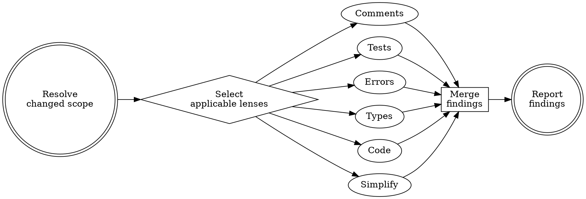

# PR Review Toolkit

## Overview

Run a focused pull-request review with six independent review lenses. Each lens examines the changed files from a different quality angle, then the coordinator merges findings into one severity-ordered report.

**Non-negotiable constraints:**
1. Review the changed scope by default: `git diff`, staged changes, or the PR diff the user names.
2. Keep findings advisory. Do not modify files unless the user explicitly asks for fixes.
3. Preserve the six-lens structure. Do not collapse a comprehensive review into one generic reviewer.
4. Run independent lenses in parallel unless the user asks for sequential review or one lens depends on another result.

## When to Use

- Before committing code or opening a PR
- Before marking a PR ready for review
- After updating a PR in response to feedback
- When the user asks to review tests, comments, error handling, types, code quality, or simplification opportunities
- When a completed implementation needs an independent review pass

## Review Scope

Resolve the scope before dispatching review lenses:

1. If the user names a PR, inspect that PR diff.
2. Else if staged changes exist, inspect staged and unstaged changes unless the user says otherwise.
3. Else inspect `git diff` against the working tree or the branch base.
4. If no changed files exist, ask the user for the PR, branch, commit range, or file list.

Use the user's requested aspects when provided. Default to all applicable lenses.

## Review Lenses

| Lens | Use When | Looks For |
|------|----------|-----------|
| `comment-analyzer` | Comments, docs, docstrings, README/API docs changed | Inaccurate comments, obsolete TODOs, comments that restate obvious code, missing why-context |
| `pr-test-analyzer` | Any behavior, tests, validation, integration, or bug fix changed | Missing behavioral coverage, untested edge cases, brittle tests, tests coupled to implementation |
| `silent-failure-hunter` | Catch blocks, fallbacks, retries, optional/null handling, error messages changed | Silent failures, swallowed errors, unjustified fallbacks, missing context, broad catches |
| `type-design-analyzer` | Types, schemas, models, DTOs, state machines, domain entities changed | Weak invariants, mutable internals, invalid states, missing construction validation |
| `code-reviewer` | Always for comprehensive review | Project-rule violations, likely bugs, security issues, race conditions, meaningful quality problems |
| `code-simplifier` | After the code is behaviorally acceptable or user asks for polish | Unnecessary complexity, redundant abstractions, unclear names, excessive nesting, clever code |

## Workflow



### Step 1 - Resolve Scope

Identify the files and diff range. Include the exact scope in every lens prompt.

Useful commands when available:
- `git status --short`
- `git diff --name-only`
- `git diff --cached --name-only`
- `gh pr view --json number,title,headRefName,baseRefName,files` when reviewing an existing GitHub PR

### Step 2 - Select Lenses

Run all requested lenses. For a comprehensive PR review, run all six lenses. For a targeted review, run only the requested or applicable lenses, but keep the same lens definitions.

Default applicability:
- Always run `code-reviewer` for broad PR review.
- Run `pr-test-analyzer` for behavior changes, test changes, bug fixes, validation, or new features.
- Run `silent-failure-hunter` for error handling, catch blocks, fallbacks, retries, nullable paths, or external service calls.
- Run `comment-analyzer` when comments, docs, examples, or generated documentation changed.
- Run `type-design-analyzer` when types, schemas, validation models, domain models, or state shapes changed.
- Run `code-simplifier` after serious issues are absent or when the user asks for clarity/refinement.

### Step 3 - Dispatch Review Agents

Dispatch each selected lens as an independent review agent. Use generic, read-only review agents. Each prompt must include:

```markdown
Review scope:
<files, PR, or diff range>

User-requested focus:
<requested aspects or "comprehensive PR review">

Return only findings for this scope. Include file and line references. Do not modify files.
```

Use these lens prompts:

**comment-analyzer**

> Review comments and documentation in the changed scope. Verify factual accuracy against code behavior, completeness of important assumptions, long-term maintainability, misleading or stale TODO/FIXME notes, and comments that merely restate obvious code. Output Critical Issues, Improvement Opportunities, Recommended Removals, and Positive Findings.

**pr-test-analyzer**

> Review test coverage quality for the changed behavior. Focus on behavioral coverage, critical edge cases, error paths, negative cases, async/concurrency risks, integration boundaries, brittle tests, and tests that assert implementation details. Rate each recommended test 1-10 by bug-prevention value. Output Critical Gaps, Important Improvements, Test Quality Issues, and Positive Observations.

**silent-failure-hunter**

> Review error handling in the changed scope. Find empty or broad catches, log-and-continue paths, swallowed errors, unjustified fallbacks, missing user feedback, missing debug context, retry exhaustion, optional/null handling that hides failure, and production fallbacks to mocks or stubs. For each issue include Location, Severity, Hidden Errors, User Impact, and Recommendation.

**type-design-analyzer**

> Review changed types, schemas, domain models, DTOs, and state shapes. Identify invariants, then rate Encapsulation, Invariant Expression, Invariant Usefulness, and Invariant Enforcement from 1-10. Flag mutable internals, invalid states, missing construction validation, over-broad types, and types that rely on comments or external code to preserve invariants.

**code-reviewer**

> Review changed code against the project's explicit instructions and likely production bugs. Read project instruction files when present. Report only high-confidence issues: explicit rule violations, real bugs, security issues, race conditions, null/undefined hazards, meaningful accessibility issues, or serious maintainability problems. Score confidence 0-100 and report only issues >=80.

**code-simplifier**

> Review recently changed code for simplification opportunities that preserve exact behavior. Find unnecessary complexity, redundant abstractions, unclear names, excessive nesting, clever compact code, identity transforms, and comments that explain obvious code. Do not propose broad refactors or behavior changes. Output concrete simplification suggestions with file/line references.

### Step 4 - Merge Findings

Merge the lens outputs into one report:

1. Deduplicate overlapping findings across lenses.
2. Preserve which lens found each issue.
3. Sort by severity: Critical, Important, Suggestions.
4. Drop low-confidence nits unless the user requested exhaustive review.
5. Include skipped lenses and why they were skipped.

## Output

Print directly to the conversation. Use this structure:

```markdown
# PR Review Summary

## Scope
- Reviewed: <PR, branch range, or files>
- Lenses run: <list>
- Lenses skipped: <list with reasons>

## Critical Issues
- [<lens>] <issue> - `<file:line>`
  Impact: <why this can break users or maintainers>
  Fix: <specific recommended change>

## Important Issues
- [<lens>] <issue> - `<file:line>`
  Impact: <why this matters>
  Fix: <specific recommended change>

## Suggestions
- [<lens>] <issue> - `<file:line>`
  Fix: <specific simplification or improvement>

## Strengths
- <what is well covered or well implemented>

## Recommended Action
1. Fix critical issues first.
2. Address important issues.
3. Consider suggestions if they reduce complexity without changing behavior.
4. Re-run the affected lenses after fixes.
```

If no high-confidence issues exist, say so and include the scope, lenses run, and any residual risk.

## Quick Reference

| User Request | Lenses |
|--------------|--------|
| "Review this PR" | all applicable, usually all six |
| "Check tests" | `pr-test-analyzer` |
| "Review error handling" | `silent-failure-hunter` |
| "Check comments/docs" | `comment-analyzer` |
| "Review these types" | `type-design-analyzer` |
| "Code review before commit" | `code-reviewer`, plus applicable specialized lenses |
| "Simplify this" | `code-simplifier` after correctness review |

## Common Mistakes

- **Using one generic reviewer for a comprehensive request.** The toolkit's value is separate lenses with independent focus.
- **Reviewing the entire repository by default.** Start with the diff or PR scope unless the user asks broader.
- **Skipping the test lens because tests exist.** Existing tests can still miss the behavior that changed.
- **Skipping error review because code compiles.** Silent failures are behavioral bugs, not type errors.
- **Running simplification before serious review findings.** Simplification is polish after correctness and project-rule issues are known.
- **Leaving Claude-specific commands or frontmatter in portable instructions.** Use generic actions: dispatch agents, inspect diffs, merge findings.

## Framework tail
Before finishing, read `../shared/cleanup.md` (relative to this skill's repo directory; fallback `$JP_SKILLS_REPO/shared/cleanup.md`) and follow it.
