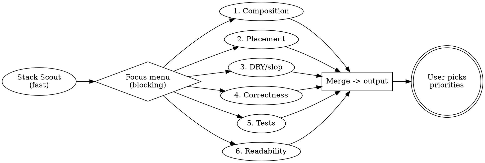

# Code Quality Audit

## Overview

Dispatch one fast scout, confirm focus with the user, then fan six lenses out in parallel. Focus is weighting, not subset: all six lenses always run; the chosen focus gets Critical weight while the rest drop to Moderate+. Read-only; the user owns all edits.

**Non-negotiable constraint:** No fix may change application behavior. Every recommendation targets structure, abstraction, tests, or readability — never logic.

## When to Use

- Before a refactor or release stabilization
- Inheriting or onboarding to a messy codebase
- Periodic hygiene with a specific focus (UI bugs vs code bugs vs cleanup)
- When NOT to use: scoped subsystem architecture (use `architecture-audit`); security review; linter/style-only pass.

## Pipeline



## Step 1 - Stack Scout (fast agent)

Read root manifests (`package.json`, `Cargo.toml`, `pyproject.toml`, `go.mod`), root configs (`next.config.*`, `vite.config.*`, `tsconfig.json`, `tauri.conf.json`), sample extensions under `src/`. Return exactly:

```text
stack: <next.js | elysia | vite-tauri | rust | django | rails | spring | dotnet | unknown>
gui: <none | react-ssr | react-spa | tauri | other>
dominant_libs: [<top 3-5 by import count>]
stack_concerns: [<2-4 architectural bullets, e.g. RSC/client boundary, Elysia plugin scope, Tauri IPC side>]
mixed: <false | true + slice candidates, e.g. apps/web, apps/api, src-tauri>
```

If `mixed: true`, list slice candidates (monorepo apps, `src-tauri/`, service dirs). Intake must force a single-slice pick. No multi-slice single pass.

## Step 2 - Focus Intake (blocking)

Present the scout result, then ask:

1. **Focus:** UI bugs / Code bugs / Cleanup-slop / Full audit (default Full).
2. **Slice (only if mixed):** pick exactly one; required before lenses run.
3. **Severity threshold:** default Moderate and above; Minor dropped.
4. **Scope:** default whole repo (or chosen slice); user may narrow to a dir.
5. **Emphasize/skip:** optional free-text.

Weighting: chosen focus runs at full weight (may file Criticals); non-focus lenses file Moderate at highest. Full audit: all six at full weight.

## Step 3 - Six Lenses (parallel)

Shared preamble appended to every lens prompt: "Prefer functional units doing one thing well: stateless inner plus stateful wrapper that gathers hooks; hooks as a separate module behind a provider/adapter; route as thin adapter delegating to a service; composition over multi-thing modules. Flag the 10-components-in-one-file shape wherever it appears."

### Lens 1 - Composition and Single-Purpose

Multi-thing functions, stateful/stateless mixing in one file, god modules, wrapper components swallowing inner components that should compose. Proposed shape: stateless inner + stateful wrapper + hooks module + provider/adapter split.

### Lens 2 - Concern Placement

Logic at the wrong layer, using `stack_concerns` as the table: auth/session in pages (belongs in middleware), business logic in route handlers (belongs in service), FS/heavy compute in JS (belongs in a Rust command), duplicated validation a schema would enforce. Only flag moves that cut duplication or fix correctness.

### Lens 3 - DRY and Slop

Duplication across 2+ files with minor variation: repeated fetch/error patterns, copy-paste utils, repeated Tailwind/class combos, repeated auth+tenant+pagination preambles, repeated query/schema fragments. Group by the abstraction that kills the group. Skip sub-3-line duplication.

### Lens 4 - Correctness and Bugs

Real bugs only: null/empty/error paths, tenant leaks (missing user `where`), mutations without `where`, secret-shaped `VITE_*` env (ships in bundle), overbroad allowlists (`fs **`, `origin *` + credentials), swallowed errors (`catch {}`), raw error leakage to clients. Any leaked secret, tenant leak, or `where`-less mutation is Critical by default.

### Lens 5 - Tests and Seams

Untested units with branching logic, branch-coverage gaps, error-path gaps (401/403/404/422/500), mock-abuse hiding integration risk, untestable wiring with no seam, tests asserting nothing. Skip trivial files (re-exports, type-only, generated bindings).

### Lens 6 - Readability and Comments

Functions over ~40 lines doing multiple things, unclear names (`data`, `result`, `temp`, `handleClick2`), nesting over 3 levels, magic literals, boolean-arg soup, `any` that could be typed, comments describing WHAT instead of WHY, verbose or stale comments, dead code and orphaned files. Skip style/linter-only nits.

## Output

Print directly to the conversation. Do not write to a file. Use this structure:

```markdown
# Code Quality Audit - [Project / Slice]

> No skill action changed application code. The implementor owns all edits.

## Summary

- Stack: <stack + gui + dominant_libs>
- Slice: <repo-wide | path>
- Focus: <UI bugs | Code bugs | Cleanup | Full>
- Findings: <N> (Critical <a>, Moderate <b>, Minor <c>)

## Critical

### [CQ-001] <short title>
- Files: `<path:lines>`, ...
- Lens: <Composition | Placement | DRY | Correctness | Tests | Readability>
- Current: <what exists>
- Recommended: <shape, no diff>
- Why: <human benefit>

## Moderate
(repeat shape)

## Minor
(repeat shape)
```

## Rules for All Lenses

1. **No behavior changes.** Never flag removing a check that changes null/error behavior.
2. **Be specific.** File paths, line ranges, concrete references. No vague "consider improving".
3. **Explain WHY.** Every finding states the benefit in human terms.
4. **Skip trivial.** Style, formatting, sub-3-line duplication.
5. **Group related.** Five files, one pattern: one finding with the union of paths.
6. **Prioritize ruthlessly.** Past 50 items, drop Minors until it fits.
7. **One lens, one perspective.** Lenses do not poach; merge combines.

## Common Mistakes

- Running lenses before the user picks focus/slice.
- Auditing two slices in one pass on a mixed stack.
- Flagging style as structure; suggesting rewrites over targeted splits.
- Filing non-focus nits as Critical.

## Framework tail

Before finishing, read `../cleanup/SKILL.md` (relative to this skill's repo directory; fallback `$JP_SKILLS_REPO/skills/cleanup/SKILL.md`) and follow it.
